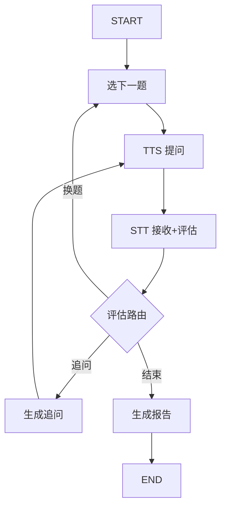

# KnockWise 项目说明 V0.2

> 一个真正会「追问」的 AI Agent 工程师语音面试 Agent。
> 不是题库生成器，是模拟真实面试官的 AI。

**实时语音技术方案**已迁移到 [`实时语音实施.md`(../30-历史/实时语音实施.md) 和 [`实时语音升级方案.md`(../30-历史/实时语音升级方案.md)。

---

## 一、产品定位（已确认）

> 一个真正会「追问」的 AI Agent 工程师语音面试 Agent。
> 不是题库生成器，是模拟真实面试官的 AI。

- 目标用户：1-5 年经验，瞄准 AI Agent 工程师岗位的程序员
- 面试方向：**AI Agent 为主，Java 后端为辅**
- 差异化：LangGraph 追问树引擎 + 实时语音对话
- 形态：Web 应用，实时语音流（非 PTT）

---

## 二、用户确认的技术选择（V0.2 修正）

| 选择 | 决策 | 对架构的影响 |
|------|------|-------------|
| 技术栈方向 | AI Agent 为主，Java 为辅 | 技能图谱 + 题库需要覆盖 LangChain/LangGraph/RAG/MCP/Agent 架构 |
| 语音方案 | 实时语音流，**零外部依赖** | LiveKit 自部署 + 本地 Whisper 流式方案，不用 Deepgram |
| 题库规模 | 50 道种子题 | 种子题覆盖 AI Agent + Java 两个方向，追问树需要手写 + LLM 辅助 |
| MVP 周期 | **4 周** | 砍掉非核心基础设施，只保留核心链路 |
| 开发工具 | **Claude Code + Cursor 混合** | Claude Code 做架构设计和 Agent 逻辑，Cursor 做前端和模板代码 |

---

## 三、面试内容方向：AI Agent 工程师技能图谱

```text
AI Agent 工程师面试知识图谱（一面 + 二面）：

一级：AI Agent 核心（权重 40%，一面高频）
├── Agent 架构设计
│   ├── ReAct / Plan-and-Execute / Multi-Agent 模式对比
│   ├── Agent 循环（观察→思考→行动→观察）
│   └── Agent 的安全边界和权限控制
├── Tool Use / Function Calling
│   ├── 工具定义和描述的最佳实践
│   ├── 工具选择的策略（何时调用哪个工具）
│   └── 工具调用失败的容错处理
├── Memory / 上下文管理
│   ├── 短期记忆 vs 长期记忆
│   ├── 上下文窗口管理策略
│   └── 对话摘要和压缩
└── MCP 协议（Model Context Protocol）
    ├── MCP 的架构（Client/Server/Transport）
    ├── Resources vs Tools vs Prompts 的区别
    └── 如何实现一个 MCP Server

二级：RAG 技术栈（权重 30%，一面 + 二面）
├── 检索策略
│   ├── 稠密检索 vs 稀疏检索 vs 混合检索
│   ├── Embedding 模型选型（BGE/M3E/text-embedding-3）
│   └── 重排序（Reranker）的作用和原理
├── 分块策略
│   ├── 固定分块 vs 语义分块 vs Late Chunking
│   └── Chunk Size 对检索质量的影响
├── 高级 RAG
│   ├── GraphRAG 原理和适用场景
│   ├── Self-RAG / Corrective RAG
│   ├── HyDE（假设文档嵌入）
│   └── Contextual RAG
└── RAG 评估
    ├── RAGAS 评估指标（Faithfulness/Relevancy/Precision/Recall）
    └── 如何构建 RAG 的 Golden Dataset

三级：LangChain & LangGraph（权重 20%，二面 + 项目深挖）
├── LangChain 核心概念
│   ├── LCEL（LangChain Expression Language）
│   ├── Chain vs Agent 的区别
│   └── Callbacks 和 Tracing
├── LangGraph 核心概念
│   ├── StateGraph 设计和最佳实践
│   ├── 条件分支 vs 固定路由
│   ├── Human-in-the-loop 模式
│   └── Checkpointing 和持久化
└── 项目实战
    └── 用 LangGraph 实现过的 Agent 项目（简历深挖）

四级：Java 后端基础（权重 10%，一面保底）
├── JVM 基础（内存模型、GC）
├── 并发编程（线程池、锁机制）
└── 常用框架（Spring Boot、MyBatis）
```

---
## 四、完整技术架构

### 4.1 总体架构图

```text
┌─────────────────────────────────────────────────────────────┐
│                      KnockWise 系统架构                       │
├─────────────────────────────────────────────────────────────┤
│                                                             │
│  前端层 (Next.js / LiveKit React)                           │
│  ┌─────────┐ ┌──────────┐ ┌────────┐ ┌──────────────────┐ │
│  │ 登录页   │ │ 面试间   │ │ 画像页  │ │ 报告页           │ │
│  │ GitHub   │ │ 实时语音 │ │ 对话式  │ │ 雷达图+追问卡点  │ │
│  │ OAuth    │ │ 字幕     │ │ 画像建立│ │ 改进建议         │ │
│  └─────────┘ └──────────┘ └────────┘ └──────────────────┘ │
│                                                             │
├─────────────────────────────────────────────────────────────┤
│                                                             │
│  API 层 (FastAPI)                                          │
│  ┌────────────┐ ┌────────────┐ ┌────────────┐              │
│  │ Auth Router│ │Interview   │ │ Report     │              │
│  │ /api/auth  │ │/api/interv │ │/api/report │              │
│  └────────────┘ └────────────┘ └────────────┘              │
│                                                             │
│  WebRTC 层 (LiveKit)                                       │
│  ┌────────────────────────────────────────────┐            │
│  │ LiveKit Server → Agent Worker → STT/TTS    │            │
│  └────────────────────────────────────────────┘            │
│                                                             │
├─────────────────────────────────────────────────────────────┤
│                                                             │
│  核心引擎层                                                 │
│  ┌────────────────────────────────────────────┐            │
│  │         LangGraph Agent 引擎                 │            │
│  │  ┌──────────┐ ┌──────────┐ ┌──────────┐   │            │
│  │  │ 画像建立  │ │ 面试编排  │ │ 追问引擎  │   │            │
│  │  │ Agent    │ │ Agent    │ │ Agent    │   │            │
│  │  └──────────┘ └──────────┘ └──────────┘   │            │
│  │  ┌──────────┐ ┌──────────┐ ┌──────────┐   │            │
│  │  │ 出题引擎  │ │ 评估引擎  │ │ 报告引擎  │   │            │
│  │  └──────────┘ └──────────┘ └──────────┘   │            │
│  └────────────────────────────────────────────┘            │
│                                                             │
├─────────────────────────────────────────────────────────────┤
│                                                             │
│  数据层                                                     │
│  ┌──────────┐ ┌──────────┐ ┌──────────┐ ┌──────────┐     │
│  │ PostgreSQL│ │ Qdrant    │ │ Redis     │ │ MinIO    │     │
│  │ 用户/画像 │ │ 题库向量  │ │ 会话缓存  │ │ 语音文件  │     │
│  │ 面试记录  │ │ 相似题检索│ │ Token缓存 │ │ 简历PDF  │     │
│  └──────────┘ └──────────┘ └──────────┘ └──────────┘     │
│                                                             │
└─────────────────────────────────────────────────────────────┘
```

### 4.2 数据库设计

```sql
-- 核心表设计

-- 用户表
users (
    id UUID PK,
    github_id TEXT UNIQUE,
    github_username TEXT,
    avatar_url TEXT,
    email TEXT,
    created_at TIMESTAMP,
    last_login_at TIMESTAMP
)

-- 用户画像（对话中自然积累，不是表单填写）
profiles (
    id UUID PK,
    user_id UUID FK → users,
    tech_stack JSONB,           -- ["LangChain", "LangGraph", "RAG", "Java"]
    years_of_exp INT,
    current_level TEXT,         -- "junior" | "mid" | "senior"
    target_companies JSONB,     -- ["bytedance", "alibaba"]
    resume_summary TEXT,        -- AI 提取的简历摘要（不存原文）
    skill_map JSONB,            -- {"LangGraph": {"level": 3, "last_tested": "..."}}
    created_at TIMESTAMP,
    updated_at TIMESTAMP
)

-- 面试记录
interviews (
    id UUID PK,
    user_id UUID FK → users,
    profile_id UUID FK → profiles,
    round TEXT,                 -- "round1" | "round2"
    style TEXT,                 -- "standard" | "bytedance" | "alibaba"
    status TEXT,                -- "in_progress" | "completed" | "abandoned"
    started_at TIMESTAMP,
    ended_at TIMESTAMP,
    total_questions INT,
    overall_score DECIMAL
)

-- 题目记录（面试中的单题详情）
question_records (
    id UUID PK,
    interview_id UUID FK → interviews,
    question_id UUID FK → questions,
    question_text TEXT,
    user_answer TEXT,
    followup_chain JSONB,       -- [{q: "...", a: "...", score: N}, ...]
    score INT,                  -- 1-5
    blind_spots JSONB,          -- ["channel底层原理", "逃逸分析"]
    time_spent INT,             -- 秒
    created_at TIMESTAMP
)

-- 题库
questions (
    id UUID PK,
    topic TEXT,                 -- "agent_architecture" | "rag" | "langgraph" | "java"
    sub_topic TEXT,             -- "react_agent" | "embedding" | "state_graph"
    difficulty INT,             -- 1-5
    round TEXT,                 -- "round1" | "round2"
    question_text TEXT,
    answer_key_points JSONB,    -- ["GMP模型", "P的数量=GOMAXPROCS"]
    followup_tree JSONB,        -- 追问树结构（JSON）
    created_at TIMESTAMP
)

-- 面试报告
reports (
    id UUID PK,
    interview_id UUID FK → interviews,
    user_id UUID FK → users,
    radar_data JSONB,           -- {topic: score}
    top_blind_spots JSONB,      -- [{topic, level, suggestion}]
    improvement_plan JSONB,     -- [{action, resources}]
    full_transcript TEXT,
    created_at TIMESTAMP
)
```

### 4.3 追问树数据结构

```json
{
  "question_id": "q_agent_001",
  "question": "ReAct Agent 模式的核心循环是什么？",
  "answer_key_points": [
    "Thought → Action → Observation 循环",
    "Thought: 基于当前信息推理下一步",
    "Action: 选择一个工具并执行",
    "Observation: 获取工具执行结果",
    "重复直到得到最终答案"
  ],
  "followup_tree": {
    "type": "answer_router",
    "branches": [
      {
        "condition": "答出完整循环且有例子",
        "followup": "ReAct 和 Plan-and-Execute 相比，各有什么优劣？",
        "depth": 2,
        "branches": [
          {
            "condition": "答对且能对比",
            "followup": "如果一个 Agent 需要调用 50 个工具，你会怎么设计工具选择策略？",
            "depth": 3,
            "branches": [
              {
                "condition": "提到工具分组/路由",
                "followup": "工具描述（tool description）太长了塞不进 context window 怎么办？",
                "depth": 4
              },
              {
                "condition": "答不上来",
                "action": "give_hint",
                "hint": "想想工具分组、动态检索工具描述这些思路",
                "depth": 3
              }
            ]
          },
          {
            "condition": "只能说出表面区别",
            "action": "probe",
            "followup": "什么场景下 Plan-and-Execute 比 ReAct 更好？举个例子",
            "depth": 3
          },
          {
            "condition": "答不上来",
            "action": "degrade",
            "followup": "没关系。那你项目里用的是什么 Agent 模式？为什么选它？",
            "depth": 2
          }
        ]
      },
      {
        "condition": "只说出部分循环",
        "action": "probe",
        "followup": "你说到了 Thought 和 Action，那 Observation 之后呢？",
        "depth": 2
      },
      {
        "condition": "完全不会",
        "action": "skip_and_record",
        "record_blind_spot": "agent_basics",
        "next_question": "q_agent_004",
        "depth": 1
      }
    ]
  }
}
```

### 4.4 LangGraph 状态图设计

```python
from typing import TypedDict, Literal, Annotated
from langgraph.graph import StateGraph, END
import operator

# 面试状态定义
class InterviewState(TypedDict):
    # 用户画像
    user_id: str
    profile: dict
    resume_projects: list[dict]
    
    # 面试配置
    round: Literal["round1", "round2"]
    style: Literal["standard", "bytedance", "alibaba"]
    
    # 当前状态
    current_topic: str
    current_question: dict  # 包含 question_text + followup_tree
    current_depth: int      # 当前追问深度 1-4
    user_answer: str
    answer_evaluation: dict  # {score, matched_branch, blind_spots}
    
    # 进度
    questions_asked: Annotated[list, operator.add]  # 已问题目列表
    questions_remaining: list  # 待问题目列表
    total_score: float
    blind_spots: Annotated[list, operator.add]
    
    # 对话历史
    messages: Annotated[list, operator.add]
    
    # 控制
    should_continue: bool
    interview_phase: Literal["intro", "questioning", "evaluating", "done"]


# 节点定义
def select_next_question(state: InterviewState) -> InterviewState:
    """出题引擎：根据画像 + 轮次 + 已有题目，选择下一道题"""
    pass

def ask_question(state: InterviewState) -> InterviewState:
    """TTS 提问：将题目转为面试官语音"""
    pass

def receive_answer(state: InterviewState) -> InterviewState:
    """STT 接收用户回答 + 初步评估"""
    pass

def evaluate_and_route(state: InterviewState) -> Literal["followup", "next_question", "end_interview"]:
    """评估答案质量，决定下一步：追问 / 换题 / 结束"""
    pass

def generate_followup(state: InterviewState) -> InterviewState:
    """追问生成：根据回答走 followup_tree 对应分支"""
    pass

def generate_report(state: InterviewState) -> InterviewState:
    """生成面试报告"""
    pass


# 构建 Graph
workflow = StateGraph(InterviewState)

workflow.add_node("select_question", select_next_question)
workflow.add_node("ask", ask_question)
workflow.add_node("receive", receive_answer)
workflow.add_node("followup", generate_followup)
workflow.add_node("report", generate_report)

workflow.set_entry_point("select_question")
workflow.add_edge("select_question", "ask")
workflow.add_edge("ask", "receive")
workflow.add_conditional_edges(
    "receive",
    evaluate_and_route,
    {
        "followup": "followup",
        "next_question": "select_question",
        "end_interview": "report"
    }
)
workflow.add_edge("followup", "ask")  # 追问后回到提问
workflow.add_edge("report", END)
```



### 4.5 面试引擎各 Agent 的职责

```text
┌─────────────────────────────────────────────────────────┐
│                  LangGraph Agent 矩阵                    │
├───────────────┬─────────────────────────────────────────┤
│ Agent         │ 职责                                    │
├───────────────┼─────────────────────────────────────────┤
│ 画像建立 Agt  │ 从对话中提取结构化画像                    │
│               │ 从简历 PDF 中提取项目经验                 │
│               │ 确认画像准确性                            │
├───────────────┼─────────────────────────────────────────┤
│ 出题 Agent    │ 根据画像 + 轮次 + 已问题目选择下一题       │
│               │ 从题库检索匹配题目                        │
│               │ 根据简历项目生成个性化题目                 │
│               │ 避免同一考点重复出题                      │
├───────────────┼─────────────────────────────────────────┤
│ 追问引擎      │ 加载当前题目的 followup_tree              │
│ ★ 核心       │ 根据用户回答匹配分支                       │
│               │ 执行对应 action（追问/提示/降级/跳过）    │
│               │ 追问措辞口语化自然化                      │
│               │ 记录盲区标记                              │
├───────────────┼─────────────────────────────────────────┤
│ 评估 Agent    │ 单题评分（1-5）                          │
│               │ 判断答案匹配哪个分支                      │
│               │ 提取具体知识盲区                          │
│               │ 决定是否继续追问还是换题                   │
├───────────────┼─────────────────────────────────────────┤
│ 报告 Agent    │ 汇总所有题目的评分                        │
│               │ 生成能力雷达图数据                        │
│               │ 识别 TOP3 薄弱点                         │
│               │ 给出针对性学习建议                        │
└───────────────┴─────────────────────────────────────────┘
```

### 4.6 技术栈总览（零外部依赖版）

```text
后端（全部 Docker 化）:
  ├── Python 3.12+
  ├── FastAPI（REST API + WebSocket）
  ├── LangGraph 1.x（Agent 状态图编排）
  ├── LangChain 1.x（工具调用、模型包装、RAG）
  ├── LiveKit Server（Docker 自部署，Apache 2.0 开源）
  ├── LiveKit Agents Python SDK（Agent Worker）
  ├── WhisperLive（本地流式 STT，faster-whisper + Silero VAD）
  ├── piper-tts（本地 TTS，C++ 引擎，中文女声模型）
  ├── DeepSeek-V3 via 硅基流动（LLM，已有 key，后续可换 Ollama）
  ├── PostgreSQL（用户、面试记录、题库）
  ├── Qdrant → 砍掉，MVP 用 JSON 文件 + Python 内存检索
  ├── Redis → 砍掉，MVP 单用户不需要缓存
  └── MinIO → 砍掉，MVP 简历/语音本地文件存储

前端:
  ├── Next.js 15
  ├── LiveKit React Components（WebRTC 前端）
  ├── Tailwind CSS
  └── Recharts（雷达图）

部署:
  ├── Docker Compose（一键启动：LiveKit + WhisperLive + Backend + Frontend + PostgreSQL）
  └── 单机 4C8G（Mac 本地开发够用）

外部服务（仅一个）:
  └── 硅基流动 DeepSeek-V3 API（已有，后续可换 Ollama + 本地模型）
```

### 4.7 简化清单：MVP 砍掉的东西

```text
砍掉的原因：4 周 + 一个人 + 验证核心价值优先

砍掉（MVP 不做）:
  ├── Qdrant 向量库 → 题库才 50 道，用 JSON + Python dict 检索足够
  ├── Redis 缓存 → 单用户 MVP 不需要
  ├── MinIO 对象存储 → 本地文件系统足够
  ├── 用户画像持久化（A4）→ localStorage 存基础信息
  └── 面试风格切换（B4）→ 一个通用风格先打透

保留（MVP 必须）:
  ├── GitHub OAuth 登录
  ├── 对话式画像 + 简历上传
  ├── 一面 + 二面 + 追问树引擎
  ├── 实时语音流（全本地）
  ├── 单题反馈 + 面试报告
  └── 50 道种子题

## 五、MVP 开发计划（4 周）

### 工具策略
```
Claude Code 负责:
  ├── 架构设计讨论
  ├── LangGraph Agent 状态图和节点实现
  ├── 追问树引擎核心逻辑
  ├── 数据库 Schema 和数据模型
  └── 种子题库（50 道 + 追问树 JSON）的辅助生成

Cursor 负责:
  ├── FastAPI 路由和模板代码
  ├── Next.js 页面和组件
  ├── LiveKit React 集成
  ├── Tailwind 样式
  └── 配置文件（Dockerfile、docker-compose）
```text

### 4 周详细计划

```
Week 1: 基础设施 + 题库（最重要的一周）
┌─────────────────────────────────────────────┐
│ Day 1-2: 项目骨架                            │
│  ├── Claude Code: 设计数据模型 + Agent 接口   │
│  ├── Cursor: FastAPI 脚手架 + PostgreSQL     │
│  └── 产出: docker-compose up 能跑起来         │
│                                              │
│ Day 3-4: GitHub OAuth + 数据模型              │
│  ├── Cursor: OAuth 流程 + User/Profile CRUD  │
│  └── 产出: 能登录，能看空白画像               │
│                                              │
│ Day 5-7: 50 道种子题库 + 追问树 ★             │
│  ├── Claude Code: 辅助生成每道题的            │
│  │   followup_tree JSON + answer_key_points  │
│  ├── 人工审核: 追问分支是否合理               │
│  └── 产出: seed_data/ 目录下 4 个 JSON 文件   │
│       agent_core.json (20 题)               │
│       rag_tech.json (15 题)                 │
│       langgraph.json (10 题)                │
│       java_backend.json (5 题)              │
└─────────────────────────────────────────────┘

Week 2: Agent 引擎（最核心的一周）
┌─────────────────────────────────────────────┐
│ Day 1-3: LangGraph 面试编排状态图             │
│  ├── Claude Code: 实现 InterviewState        │
│  │   + 5 个节点 + 条件路由                    │
│  ├── 节点: 出题 / 提问 / 接收 / 评估 / 报告   │
│  └── 产出: interview_agent.py 可单元测试       │
│                                              │
│ Day 4-5: 追问树引擎                           │
│  ├── Claude Code: 追问树加载 + 分支匹配        │
│  │   + action 执行（追问/提示/降级/跳过）      │
│  ├── 核心逻辑: 根据用户回答走 followup_tree    │
│  └── 产出: followup_agent.py 核心模块          │
│                                              │
│ Day 6-7: 出题 + 评估 Agent                    │
│  ├── 出题: 从题库选下一题（避免重复）          │
│  ├── 评估: 单题评分 + 盲区标记                │
│  └── 产出: question_agent.py + evaluate_agent │
└─────────────────────────────────────────────┘

Week 3: 语音 + 前端（打通任督二脉）
┌─────────────────────────────────────────────┐
│ Day 1-3: 语音链路                            │
│  ├── LiveKit Server Docker 部署              │
│  ├── WhisperLive 部署 + 中文模型加载           │
│  ├── piper-tts 集成 + 中文女声模型            │
│  ├── LiveKit Agent Worker 骨架               │
│  └── 产出: 能够语音对话（先不做 Agent 追问）    │
│                                              │
│ Day 4-5: 前端页面                            │
│  ├── Cursor: Next.js + LiveKit React 集成     │
│  ├── 页面: 登录 → 画像对话 → 面试间           │
│  └── 产出: 基础页面能跑通                     │
│                                              │
│ Day 6-7: Agent + 语音联调                     │
│  ├── Claude Code: 对接 Agent 到语音 Worker    │
│  ├── 端到端: 语音输入 → STT → Agent → TTS    │
│  └── 产出: 完整语音面试链路跑通                │
└─────────────────────────────────────────────┘

Week 4: 报告 + 打磨 + 发布
┌─────────────────────────────────────────────┐
│ Day 1-2: 面试报告生成                         │
│  ├── 报告 Agent: 能力雷达图 + 追问卡点        │
│  ├── 报告页面: Recharts 可视化               │
│  └── 产出: 面试完能看报告                     │
│                                              │
│ Day 3-4: 体验打磨                            │
│  ├── 语音质量优化（Whisper prompt 工程）      │
│  ├── 追问措辞自然化（面试官人格优化）          │
│  ├── 边界 case 处理                          │
│  └── 产出: 自己完整面试一遍，录 Demo           │
│                                              │
│ Day 5-7: 发布                                 │
│  ├── VPS 部署（Docker Compose 一键）          │
│  ├── 写技术文章（"用 LangGraph 做了一个        │
│  │   会追问的面试官 AI"）                     │
│  ├── V2EX/掘金/牛客 发布                     │
│  └── 产出: 产品上线 + 第一篇文章               │
└─────────────────────────────────────────────┘
```text

---

## 六、关键风险和应对

| 风险 | 概率 | 影响 | 应对 |
|------|------|------|------|
| WhisperLive 中文转录准度不够 | 中 | 高 | faster-whisper-medium 模型 + AI 术语词典（Whisper prompt 注入术语表） |
| 实时语音流总延迟 >3 秒 | 中 | 高 | piper-tts + whisper 并行处理，PTT 模式作为降级方案 |
| 追问树覆盖不全 | 高 | 中 | 追问树有兜底分支（默认追问方向），同时 LLM 实时补充分支 |
| 本地资源不够（4C8G 跑全部服务） | 低 | 中 | 开发阶段 Mac 16G 够用，部署可换 8C16G VPS |
| LiveKit Agent Worker 不稳定 | 中 | 中 | Worker 崩溃自动重启 + 面试状态持久化防止丢失 |
| 一个人时间不够 | 中 | 高 | Claude Code + Cursor 双工具提速，严格 MVP 范围，不做任何 P1 功能 |

---

## 七、P0 实现状态（2026-06-12 完成）

### 7.1 ORM Models

`backend/models/__init__.py` — 6 个 SQLAlchemy 2.0 模型，所有 PK 为 String(36)（UUID-as-string）：

```python
# 实体关系
User ──< Profile ──< Interview ──< QuestionRecord
  │                    │
  └──< Report ─────────┘
```

| 模型 | 表名 | 关键字段 |
|---|---|---|
| `User` | users | id, github_id(unique), github_username, avatar_url, email, last_login_at, created_at |
| `Profile` | profiles | id, user_id(FK), tech_stack(JSON), years_of_exp, current_level, target_companies(JSON), resume_summary, skill_map(JSON) |
| `Interview` | interviews | id, user_id(FK), profile_id(FK), round, style, status, **state_snapshot(JSON)**, total_questions, overall_score |
| `QuestionRecord` | question_records | id, interview_id(FK), question_id(nullable), question_text, user_answer, followup_chain(JSON), score, blind_spots(JSON), time_spent |
| `Question` | questions | id(语义ID, PK), topic, sub_topic, difficulty, round, question_text, answer_key_points(JSON), followup_tree(JSON) |
| `Report` | reports | id, interview_id(FK), user_id(FK), radar_data(JSON), top_blind_spots(JSON), improvement_plan(JSON) |

设计决策：
- JSON 列用 `sqlalchemy.JSON`，MySQL 8.4 原生支持
- 枚举值（round、status、style）用 String 列，不用 MySQL ENUM
- `Question.id` 用语义 ID（如 `"agent_001"`），种子数据提供预定义 ID
- 去掉了 PostgreSQL JSONB 依赖，全程 MySQL 8.4

### 7.2 Session 持久化

`InterviewSessionManager` 新增两个方法：

- `save_state(session_id, db)` — 将当前 InterviewState 序列化写入 `interviews.state_snapshot`
- `restore_from_db(session_id, db)` — 从 DB 快照恢复内存 session

API 路由的持久化调用点：
| 端点 | 持久化时机 |
|---|---|
| `POST /api/interviews` | 创建 session 后立即 save |
| `POST /{id}/next-question` | 选题后 save；若 session 丢失，先 restore_from_db |
| `POST /records/{id}/answer` | 评估后 save；若 session 丢失，先 restore_from_db → 失败则 fallback 到直接 agent 调用 |

关键设计：
- **JSON snapshot 方式**（不用 LangGraph SqliteSaver）— 当前代码绕过 graph 直接操作 state dict
- **非 JSON 安全值自动过滤**（`_serializable_state()`）
- **Best-effort 语义** — save 失败不影响面试继续

### 7.3 修复项

1. **`.gitignore`**: `backend/models/` 改为精确匹配 `*.pt`/`*.bin`/`*.onnx`（原来阻止了 ORM models 提交）

2. **Pydantic `QuestionOut.id` 类型错误**: `id: UUID` → `id: str`
   - 根因：`Question.id` 是语义字符串（`"agent_001"`），不是 UUID
   - 影响：`QuestionOut.model_validate(question)` 抛 `uuid_parsing` 校验错误

3. **Pydantic `answer_key_points` / `followup_tree` 为 None 时校验失败**
   - 根因：SQLAlchemy 在 flush 前不会应用 `default=[]`，pydantic 收到 `None` → 报 `list_type` / `dict_type` 错误
   - 修复：添加 `@field_validator(mode='before')`，None → `[]` / `{}`

4. **Pydantic `model_config` 格式**: `{"from_attributes": True}` → `ConfigDict(from_attributes=True)`
   - pydantic V2 推荐使用 `ConfigDict` 而非裸 dict

5. **IDEA Python SDK 路径指向错误**
   - IDEA 配置的 venv 路径：`Intervue/.venv/`（根目录，依赖未安装）
   - 实际 venv 路径：`Intervue/backend/.venv/`（pip install -r requirements.txt 在此执行）
   - 修复：`jdk.table.xml` 中两处路径改为 `backend/.venv/`

6. **`requirements.txt` 依赖版本冲突**
   - `langgraph==1.0.0` + `langchain-openai==0.3.0` → `langchain-core` 版本冲突（0.x vs 1.x）
   - 根因：requirements.txt 固定了旧版本，新版 pip resolver 拒绝安装
   - 实际运行环境已安装新版本（langgraph 1.2.4, langchain-openai 1.3.0）且兼容
   - 临时方案：使用 `backend/.venv` 中已安装的版本；长期：更新 requirements.txt 解除固定版本

---

### 7.4 Voice Pipeline 踩坑记录

**问题**：前端连接 LiveKit 正常，但面试官不说话、用户语音无反应。

**根因**：LiveKit Agent Worker (`voice/livekit_worker.py`) 依赖 `livekit-agents` 和 `livekit-plugins-silero`，它们不在 `pip install livekit` 的依赖中。`livekit` PyPI 包 v1.x 是客户端 SDK，不是服务端 Agent SDK。Worker 启动失败时静默——LiveKit 房间照常建立，但无人处理 STT→Agent→TTS 管道。

**解决**：
```bash
pip install livekit-agents livekit-plugins-silero
python voice/livekit_worker.py  # 必须手动启动，不会随 FastAPI 自动启动
```

**教训**：`livekit-agents` 和 `livekit` 是两个不同的包。Worker 进程需要独立启动和监控。后续可以考虑用 `supervisord` 或 Docker 管理 Worker 生命周期。

---

## 八、下一步确认

1. AI Agent 技能图谱覆盖（Agent 核心 40% / RAG 30% / LangGraph 20% / Java 10%）→ 这个权重合理吗？
2. LiveKit + Deepgram 实时流方案 → 外部服务依赖可以接受吗？
3. 6 周 MVP 计划 → 周期合理吗？
