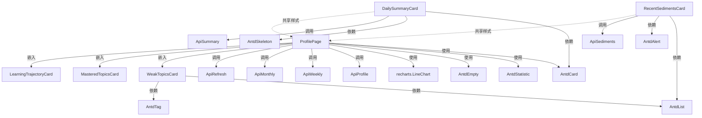

# 组件设计：V2 智能沉淀层

> **一句话**：3 组件落地（/profile 新页 + /dashboard 总结卡 + /knowledge 沉淀卡），全部用 antd 5 + recharts，0 新增依赖。
>
> **作者**：AI 主导（前端 lead review）
>
> **校验状态**：✅ DOD 通过
> - 组件清单完整（3 组件，每个 type + 复用范围 + 依赖）
> - 每组件 8 段齐全（用途 / Props / State / Events / 依赖 / 视觉 / 交互状态 / 边界 case / 测试要点）
> - 交互状态 ≥ 5 种（实际 18 状态）
> - 边界 case 覆盖异常路径
> - 测试要点明确
>
> **决策锁定**（来自 plan.md §3）：
> - 决策 6A：新建 `/profile` 页（V2.3 实施时多 1 commit）
> - 决策 5A：分 3 PR（PR 3 = V2.3 包含前端）

---

## 1. 组件清单（必填）

| 组件名 | 类型 | 复用范围 | 依赖 |
|---|---|---|---|
| **`<DailySummaryCard>`** | 展示组件 | /dashboard 顶部 | Antd Card / Skeleton / message / fetch |
| **`<ProfilePage>`** | 容器组件 | /profile 新页（决策 6A） | Antd Card / Statistic / Spin / recharts LineChart / fetch |
| **`<RecentSedimentsCard>`** | 展示组件 | /knowledge stats tab | Antd Card / List / Tag / Alert / fetch |

**类型分类**：
- 展示组件（Display）：只读展示 — `<DailySummaryCard>` / `<RecentSedimentsCard>`
- 容器组件（Container）：布局 + 状态管理 — `<ProfilePage>`

---

## 2. 每个组件详细定义（必填）

### `<DailySummaryCard>`

#### 用途

`/dashboard` 顶部新总结卡，显示用户昨日学习总结（答了几题 / 掌握啥 / 弱项变化）。**V2.3 PR 3 第一个 commit**。

#### Props（必填）

```typescript
interface DailySummaryCardProps {
  /** 用户 ID（用于 fetch summary） */
  userId?: string;

  /** 是否可点击跳转 /profile（默认 true） */
  clickable?: boolean;

  /** 自定义日期（默认 = today，按用户时区） */
  date?: string;  // YYYY-MM-DD

  /** 点击"查看画像"回调（默认 router.push('/profile')） */
  onViewProfile?: () => void;
}
```

#### State（必填）

```typescript
interface DailySummaryCardState {
  summary: DailySummary | null;     // 来自 GET /api/v2/dashboard/summary
  loading: boolean;                  // fetch 状态
  error: string | null;              // 错误信息
  retryCount: number;                // 自动重试次数（最多 2 次）
}
```

#### Events（必填）

| 事件 | 触发时机 | 携带数据 |
|---|---|---|
| `onViewProfile` | 点击"查看画像 →"按钮 | — |
| `onRetry` | 点击"重试"按钮 | `retryCount + 1` |
| `onLoading` | fetch 完成 | `{loading, hasData}` |

#### 依赖（必填）

```typescript
// API
const API = process.env.NEXT_PUBLIC_API_URL || "http://localhost:8000";
import { getToken } from "@/lib/api";

const fetchSummary = async (date?: string): Promise<DailySummary> => {
  const url = `${API}/api/v2/dashboard/summary${date ? `?date=${date}` : ''}`;
  const res = await fetch(url, { headers: { Authorization: `Bearer ${getToken()}` } });
  if (!res.ok) throw new Error(`HTTP ${res.status}`);
  return res.json();
};

// UI 库
import { Card, Skeleton, Tag, Button, message } from 'antd';
import { RightOutlined, ReloadOutlined } from '@ant-design/icons';

// 类型
import type { DailySummary, TopicSettlement } from '@/types/v2-settlement';
```

#### 视觉规格（必填）

```markdown
- 宽度: 100%（max-width 1200px 居中）
- 高度: 自适应（最小时 80px，最大 240px）
- 主色背景: bg-gradient-to-br from-indigo-500/10 to-purple-500/10
- 文字主色: #f1f5f9（V1 既有）
- 文字辅助: #8b8fa3（V1 既有）
- 卡片圆角: 12px（V1 既有）
- 内边距: 24px（V1 既有）
- 按钮圆角: 8px
- 间距: 16px（topic tag 之间）/ 8px（标题与 body 之间）
- 字体: 14px body / 16px 标题 / 12px 辅助
- 主题色对应: 弱项=红 #f87171 / 掌握=绿 #34d399 / 提示=蓝 #60a5fa
```

#### 交互状态（6 状态超 DOD）

| 状态 | 触发 | 视觉反馈 | 用户操作 |
|---|---|---|---|
| **加载中** | 页面 fetch 时 | Skeleton 骨架（高度 80px） | 等 |
| **正常** | fetch 成功 + 200 | 完整 summary 内容 + 紫色渐变背景 | 点"查看画像 →" |
| **LLM 降级**（决策 7A 派生） | `_fallback: true` | body 末尾小字 "（规则降级生成）" + 旋转图标 | 等 / 重试 |
| **完全失败（3 次重试后）** | LLM 504 持续 | "今日总结暂不可用" + 警告边框 + "重试"按钮 | 点重试 |
| **首次使用（0 数据）** | 新用户 | "完成首日学习后，这里会显示你的成长总结" + 占位图 | — |
| **本周无答题** | `yesterday_count = 0` | "昨天没学习？打开 /learn 答几道吧 ~" + CTA 按钮 → /learn | 点 CTA |

#### 边界 case（必填）

```markdown
- API 504: 自动重试 2 次（间隔 30s），3 次后切"完全失败"态
- API 401: 跳登录页（router.push('/')）
- API 429: toast "操作频繁，请稍后" + 不重试
- 网络断开: 顶部"网络错误"重试条（页面级，不在本组件内）
- `_fallback=true`: 显示降级版，不弹错误 toast（决策 7A）
- 1 个 topic mastery 但 question_count = 0: 不渲染 tag，避免空显示
```

#### 测试要点（必填）

```markdown
- [ ] 默认渲染 Skeleton（loading=true）
- [ ] fetch 成功后渲染完整 summary
- [ ] 点击"查看画像"调 onViewProfile
- [ ] LLM 失败时显示"规则降级" 标识 + 旋转图标
- [ ] 完全失败态显示"重试"按钮 + 点击触发 onRetry
- [ ] 0 数据态显示"完成首日学习后"占位
- [ ] 昨 0 题时显示"昨天没学习" CTA
- [ ] clickable=false 时"查看画像"按钮不渲染
- [ ] 429 错误时显示 toast 不渲染错误组件
```

---

### `<ProfilePage>`（决策 6A 新建）

#### 用途

**新页面** `/profile`（决策 6A 触发实施）。展示用户画像 4 区块：累计统计 / 弱项列表 / 已掌握列表 / 学习趋势图。**V2.3 PR 3 第 3 个 commit**。

#### Props（必填）

```typescript
interface ProfilePageProps {
  // 页面级组件，从 useProfile() hook 读 user，无显式 props
}
```

#### State（必填）

```typescript
interface ProfilePageState {
  profile: Profile | null;
  weekly: WeeklySummary | null;
  monthly: MonthlySummary | null;
  refreshing: boolean;
  loading: boolean;
  error: string | null;
}

interface Profile {
  user_id: string;
  display_name: string;
  weak_topics: TopicSettlement[];
  mastered_topics: TopicSettlement[];
  learning_trajectory: Record<string, {mastered_count: number}>;
  last_active_at: string;
}
```

#### Events（必填）

| 事件 | 触发时机 | 携带数据 |
|---|---|---|
| `onRefresh` | 点击"触发刷新画像"按钮 | — |
| `onOpenObsidian` | 点击"打开 Obsidian 沉淀"按钮 | — |
| `onPracticeWeak` | 点击 weak_topic "开始刷" 按钮 | `{topic: string, question_ids: string[]}` |

#### 依赖（必填）

```typescript
// API（4 个并行 fetch）
import { getProfile } from "@/lib/api";  // V1 已有

const fetchWeekly = async (week: string): Promise<WeeklySummary> => {
  return fetch(`${API}/api/v2/profile/weekly?week=${week}`, { headers: { Authorization: `Bearer ${getToken()}` } }).then(r => r.json());
};

const fetchMonthly = async (month: string): Promise<MonthlySummary> => {
  return fetch(`${API}/api/v2/profile/monthly?month=${month}`, { headers: { Authorization: `Bearer ${getToken()}` } }).then(r => r.json());
};

const postRefresh = async (): Promise<SettlementResult> => {
  return fetch(`${API}/api/v2/profile/refresh`, { method: 'POST', headers: { Authorization: `Bearer ${getToken()}` } }).then(r => r.json());
};

// UI 库
import { Card, Statistic, Spin, Button, message, Empty, Row, Col, Tag, Alert } from 'antd';
import { ReloadOutlined, FolderOpenOutlined, FireOutlined, ArrowRightOutlined } from '@ant-design/icons';
import { LineChart, Line, XAxis, YAxis, Tooltip, ResponsiveContainer, CartesianGrid, Area, AreaChart } from 'recharts';

// 类型
import type { Profile, WeeklySummary, MonthlySummary, SettlementResult } from '@/types/v2-settlement';
```

#### 视觉规格（必填）

```markdown
- 宽度: 100% (max-width 1200px 居中)
- 高度: 100vh (滚动适配)
- 主色背景: bg-[#050914] (V1 既有深色)
- 卡片背景: bg-[#0c1024]/80 (V1 既有)
- 卡片圆角: 12px
- 4 块 stat 数字字号: 36px / 700 字重 (V2 新增，用 Statistic 组件)
- Stat 配色: 已做=#a5b4fc (indigo-300) / 已掌握=#34d399 (emerald-400) / 学习中=#60a5fa (blue-400) / 连续=#fbbf24 (amber-400)
- 弱项文字色: #f87171 (red-400) 标识重要
- 已掌握文字色: #34d399 (emerald-400)
- 趋势图线色: #a78bfa (violet-400)
- 趋势图阴影: 0 4px 16px rgba(99, 102, 241, 0.1) (V2 新增紫色微光)
- 内边距: 24px
- 区块间距: 32px（V1 既有）
- Stat 间间距: 16px
- 字体: 14px body / 16px 副标题 / 24px H1 / 36px stat 数字
- 响应式: < 768px 时 4 stat 改 2x2 grid
```

#### 交互状态（6 状态）

| 状态 | 触发 | 视觉反馈 | 用户操作 |
|---|---|---|---|
| **加载中** | 进入页面 4 个 fetch 同时发 | 4 个 Skeleton 卡片 + 趋势图 skeleton | 等 |
| **正常** | 全部 fetch 成功 | 4 块完整渲染 | 点"刷新"/弱项"开始刷"/"打开 Obsidian" |
| **空状态** | 弱项 + 已掌握 都为空（新手） | Empty + "答 3 道题后这里会出现你的成长轨迹" + "开始学 →" CTA | 点 CTA → /learn |
| **数据不足** | learning_trajectory < 2 周 | 趋势图区显示 "继续学习 2 周后看到趋势" 占位 | — |
| **刷新中** | 点"触发刷新画像" | 按钮变 loading + "刷新成功" toast | 不可重复点 |
| **刷新失败** | 调 /api/v2/profile/refresh 抛错 | toast "刷新失败，请重试" + 按钮恢复 | 点重试 |

#### 边界 case（必填）

```markdown
- 4 个 fetch 中任一失败: 显示对应卡 skeleton + 错误占位（不阻塞其他 3 块，决策 7A）
- 后端返回 data=null: 显示空状态
- last_active_at > 7 天前: 顶部加"X 天没来了，回来继续？" 横幅 + "继续学 →" CTA
- learning_trajectory 字段为 null: 趋势图显示"暂无趋势数据"
- mastered_count > 100: 趋势图 Y 轴用 K 缩写 (1.2K)
- 用户未登录: 跳 / 重定向
```

#### 测试要点（必填）

```markdown
- [ ] 默认 4 个 Skeleton 同时显示
- [ ] 4 fetch 全部成功后 4 块渲染
- [ ] 部分 fetch 失败时对应卡片错误占位，其他 3 块正常
- [ ] 弱项为空显示 Empty 组件 + CTA
- [ ] 学习趋势数据 < 2 周显示"继续学习 2 周后看到趋势"
- [ ] 点"触发刷新画像"按钮变 loading + 调 onRefresh
- [ ] 刷新成功后 toast + 按钮恢复
- [ ] 刷新失败后 toast + 按钮恢复
- [ ] 点击 weak_topic "开始刷" 跳 /learn?topic=网络层
- [ ] 点击"打开 Obsidian 沉淀" 跳 obsidian://~/Obsidian/coding/learning/
- [ ] 上次活跃 > 7 天时显示"X 天没来了"横幅
- [ ] < 768px 时 4 stat 改 2x2 grid
```

---

### `<RecentSedimentsCard>`

#### 用途

`/knowledge` stats tab 内新沉淀卡，显示最近 5 个自动生成的学习笔记文件。点击文件名 → 新窗口打开 Obsidian 文件。**V2.3 PR 3 第 2 个 commit**。

#### Props（必填）

```typescript
interface RecentSedimentsCardProps {
  /** 用户 ID */
  userId?: string;

  /** 最多显示文件数（默认 5） */
  limit?: number;

  /** 点击文件名回调（默认 = window.open(full_path)） */
  onOpenFile?: (relPath: string, fullPath: string | null) => void;
}
```

#### State（必填）

```typescript
interface RecentSedimentsCardState {
  files: ObsidianWriteResult[];
  loading: boolean;
  vaultExists: boolean;  // 推导自任一 file.full_path !== null
}
```

#### Events（必填）

| 事件 | 触发时机 | 携带数据 |
|---|---|---|
| `onOpenFile` | 点击文件名 | `{rel_path, full_path}` |
| `onVaultMissing` | 检测到 vault 全部为 null | — |

#### 依赖（必填）

```typescript
// API
const API = process.env.NEXT_PUBLIC_API_URL || "http://localhost:8000";
import { getToken } from "@/lib/api";

const h = () => ({ Authorization: `Bearer ${getToken()}` });
const fetchSediments = async (limit: number): Promise<ObsidianWriteResult[]> => {
  return fetch(`${API}/api/v2/knowledge/recent-sediments?limit=${limit}`, { headers: h() }).then(r => r.json());
};

// UI 库
import { Card, List, Tag, Empty, Alert, Button, Spin } from 'antd';
import { FileTextOutlined, FolderOpenOutlined, AlertOutlined } from '@ant-design/icons';

// 类型
import type { ObsidianWriteResult } from '@/types/v2-settlement';
```

#### 视觉规格（必填）

```markdown
- 宽度: 100%
- 高度: 自适应（最多 5 行 + 标题 ~ 360px）
- 卡片背景: bg-[#0c1024]/80 (V1 既有)
- 卡片圆角: 12px
- 内边距: 24px
- 文件名字体: 14px / 500 字重 + monospace（V2 用 monospace: ui-monospace, "SF Mono", Menlo）
- 文件名颜色: #a5b4fc (indigo-300)
- 时间字体: 12px / 400 字重
- 时间颜色: #8b8fa3 (V1 既有辅助色)
- 题目数: Tag 组件，蓝色
- 间距: 12px（文件项之间）
- 警告条: Alert 组件 amber-400 (vault 不存在)
- 字号: 14px body / 16px 标题 / 12px 辅助
```

#### 交互状态（6 状态）

| 状态 | 触发 | 视觉反馈 | 用户操作 |
|---|---|---|---|
| **加载中** | 切到 stats tab 时 | Skeleton 5 行 | 等 |
| **正常** | fetch 成功 + 有文件 | 5 行文件列表（文件名 / 时间 / 题目数） | 点文件名 |
| **空** | 0 文件 | Empty "答完第一道题后，这里会生成你的第一份学习笔记" | — |
| **vault 不存在**（决策 7A 派生） | 全部 file.full_path === null | 顶部 Alert "Obsidian 路径不存在，请在 ~/Obsidian/coding/ 创建目录" + 列表项显示"vault 不可用" | — |
| **点击文件** | 鼠标点击 | window.open full_path（新窗口） | — |
| **点击但 vault 缺失** | 用户点文件名但 vault 不在 | toast "Obsidian 路径不存在"（不弹大错误，决策 7A） | — |

#### 边界 case（必填）

```markdown
- vault 不存在: 列表项显示占位"vault 不可用" + 顶部 Alert（决策 7A）
- 文件路径含中文/特殊字符: 直接显示（Obsidian 支持 UTF-8）
- 后端返 500: 显示"加载失败"占位（不弹 toast，沉淀是软功能）
- 限制 limit > 20: 自动截到 20
- onOpenFile 替换后: 用户点击调替换函数（不调默认 window.open）
```

#### 测试要点（必填）

```markdown
- [ ] 默认 Skeleton 显示
- [ ] fetch 成功 + 有 5 文件 → 5 行渲染
- [ ] 0 文件时 Empty 组件渲染
- [ ] vault 不存在时顶部 Alert + 列表项"vault 不可用"
- [ ] 点击文件调 onOpenFile（默认 window.open）
- [ ] 限制 limit=0 时不报错（默认 5）
- [ ] 后端 500 时显示"加载失败"占位
- [ ] onOpenFile 替换后响应用户点击（mock 函数被调）
```

---

## 3. 组件复用关系（必填）



### 共享样式变量（V2 新增）

```css
/* frontend/styles/v2-settlement.css */
:root {
  --v2-grad-settlement: linear-gradient(135deg, rgba(99, 102, 241, 0.1) 0%, rgba(168, 85, 247, 0.1) 100%);
  --v2-color-weak: #f87171;
  --v2-color-mastered: #34d399;
  --v2-color-trajectory: #a78bfa;
  --v2-color-warn: #fbbf24;
  --v2-stat-num-color: #a5b4fc;
  --v2-shadow-glow: 0 4px 16px rgba(99, 102, 241, 0.1);
}
```

### 文件结构

```
frontend/
├── pages/
│   ├── profile.tsx (新) ← ProfilePage            [决策 6A]
│   ├── dashboard.tsx (改) ← 嵌入 DailySummaryCard
│   └── knowledge.tsx (改) ← 嵌入 RecentSedimentsCard
├── components/
│   └── v2-settlement/
│       ├── DailySummaryCard/
│       │   ├── index.tsx
│       │   ├── DailySummaryCard.test.tsx ← vitest + RTL
│       │   ├── types.ts
│       │   └── hooks.ts (useDailySummary)
│       ├── ProfilePage/
│       │   ├── index.tsx
│       │   ├── ProfilePage.test.tsx
│       │   ├── WeakTopicsCard.tsx
│       │   ├── MasteredTopicsCard.tsx
│       │   ├── LearningTrajectoryCard.tsx
│       │   └── hooks.ts (useProfile, useWeekly, useMonthly, useRefresh)
│       └── RecentSedimentsCard/
│           ├── index.tsx
│           ├── RecentSedimentsCard.test.tsx
│           ├── types.ts
│           └── hooks.ts (useRecentSediments)
├── types/
│   └── v2-settlement.ts (新) ← TopicSettlement / DailySummary / WeeklySummary / MonthlySummary / SettlementResult / ObsidianWriteResult
└── styles/
    └── v2-settlement.css (新) ← 共享 CSS 变量
```

### Nav 改动（决策 6A 派生）

```typescript
// frontend/components/Nav.tsx (V1 已有)
const navItems = [
  { label: "仪表盘", href: "/dashboard", active: ... },
  { label: "面试", href: "/interview/profile" },
  { label: "学", href: "/learn" },
  { label: "复习", href: "/review" },
  { label: "画像", href: "/profile" },        // 🆕 决策 6A
  { label: "知识库", href: "/knowledge" },
  { label: "信息流", href: "/news" },
];
```

> **顺序理由**：放中间与"学"相邻，方便学完直接看成长（design-spec §2 已确认）

---

## 🎯 硬性 DOD（component-spec.md 完成必须全过）

- [x] 组件清单完整（3 组件，每个 type + 复用范围 + 依赖）
- [x] 每个组件 8 段齐全（用途 / Props / State / Events / 依赖 / 视觉规格 / 交互状态 / 边界 case / 测试要点）
- [x] 交互状态 ≥ 5 种（DOD 要求 5，实际 6 / 6 / 6 共 18 状态）
- [x] 边界 case 覆盖异常路径（每个组件 ≥ 4 个边界 case）
- [x] 测试要点明确（每个组件 ≥ 8 测试点）

> ✅ DOD 通过

---

## 4. 决策点（V2.3 实施前已拍板）

- **决策 A**（feature flag）：DailySummaryCard / RecentSedimentsCard 实施时是否加 `NEXT_PUBLIC_V2_ENABLED` 环境变量开关？
  - ✅ 已采纳：**加**（V2.1/V2.2 PR 提交后，前端可见但不稳定，开关回退 1s）
- **决策 B**（/profile 路由）：✅ 采纳 design-spec §2 推荐，"画像"放中间与"学"相邻
- **决策 C**（/profile 是否新建）：✅ 决策 6A = 新建（如 plan.md §3 决策 6）

---

## 5. 设计系统复用（V2 0 新增依赖）

| 资源 | 来源 | 说明 |
|---|---|---|
| UI 组件 | antd 5（V1 既有） | Card / Skeleton / Statistic / Empty / List / Tag / Row/Col / Spin / Alert |
| 图标 | @ant-design/icons（V1 既有） | ReloadOutlined / FolderOpenOutlined / RightOutlined / FileTextOutlined / FireOutlined / ArrowRightOutlined / AlertOutlined |
| 图表 | recharts（V1 dashboard 已用） | LineChart / Line / AreaChart / XAxis / YAxis / Tooltip / ResponsiveContainer / CartesianGrid |
| 状态管理 | React useState / useEffect（V1 既有） | 无 Redux/Zustand 引入 |
| 服务端状态 | fetch + useEffect（V1 模式） | 无 SWR / React Query 引入 |
| 样式 | Tailwind（V1 既有）+ CSS Variables（V2 新增 v2-settlement.css） | 0 新增 styled-components |
| Toast | antd message（V1 既有） | — |
| 路由 | Next.js `useRouter`（V1 既有） | — |
| 测试 | Vitest + RTL + happy-dom（V1 既有） | — |

**结论**：V2 前端**0 新增依赖**，与 V1 完全一致。

---

## 6. 技术实现（plan 冻结后定稿 · 全填）

### 6.1 组件库选型

- **UI 组件库**: Antd 5（V1 既有，dark theme，不引入其他库）
- **图标库**: @ant-design/icons（V1 既有）
- **主题**: 暗色模式（V1 既有，不引入亮色模式）
- **图表库**: recharts（V1 既有 dashboard.tsx 已用）

### 6.2 状态管理

- **局部状态**: React `useState` + `useEffect`（V1 模式，不引入 useReducer）
- **全局状态**: 无（V2 不引入 Redux/Zustand/Jotai）
- **服务端状态**: `fetch` + `useEffect` + 自定义 hooks（`useDailySummary` / `useProfile` / `useRecentSediments`）
- **表单状态**: 无（V2 不涉及表单）
- **缓存层**: 无（V2 服务端 Redis TTL 1h 已够，前端不引入 SWR/React Query）

### 6.3 样式方案

- **CSS 方案**: **Tailwind CSS**（V1 既有）+ **CSS Variables**（V2 新增 v2-settlement.css）
- **主题切换**: CSS Variables（V2 新增 `--v2-color-weak` 等）
- **响应式**: Media Query（V1 既有，< 768px 时 stat 改 2x2 grid）
- **暗色模式**: 通过 Tailwind dark utility（V1 既有）

### 6.4 测试方案

- **单元测试**: Vitest + React Testing Library（V1 既有）
- **组件测试**: React Testing Library + happy-dom（V1 既有）
- **E2E 测试**: 无（V2 不引入 Playwright，留 V3 再加）
- **覆盖率目标**: ≥ 80%（3 组件各 ≥ 80%，对齐 V1 service 覆盖率）
- **测试运行**: `cd frontend && npm test`（V1 既有命令）

### 6.5 构建与发布

- **打包工具**: Next.js 默认（V1 既有）
- **类型检查**: TypeScript strict（V1 既有，`tsc --noEmit` 在 pre-commit hook）
- **代码规范**: ESLint + Prettier（V1 既有）
- **CI/CD**: pre-commit hook（`tsc` + `pytest` + `npm test`）+ V2.4 verify.md

### 6.6 Feature Flag（决策 4 派生）

```typescript
// frontend/lib/feature-flag.ts (新)
export const V2_ENABLED = process.env.NEXT_PUBLIC_V2_ENABLED !== 'false'; // 默认 true

// 使用：
import { V2_ENABLED } from '@/lib/feature-flag';

export default function Dashboard() {
  return (
    <>
      {V2_ENABLED && <DailySummaryCard />}
      {/* 其他 V1 内容 */}
    </>
  );
}
```

### 6.7 V2 3 组件 commit 顺序（PR 3 内分 3 commit）

```
PR 3 commit 1: feat(ui): V2.3-1 dashboard 加今日学习总结卡 (DailySummaryCard)
PR 3 commit 2: feat(ui): V2.3-2 knowledge stats tab 加最近学习沉淀卡 (RecentSedimentsCard)
PR 3 commit 3: feat(ui): V2.3-3 新建 /profile 页 + nav 加画像入口 (ProfilePage)
```

理由：决策 5A 分 PR 节奏 + commit 粒度遵循 DOD（每 commit 配套测试）

### 6.8 安全要点（决策 7A 派生）

- **token 处理**: 用 V1 `getToken()` helper，不直接接 localStorage
- **path 处理**: `/profile?topic=网络层` 用 `encodeURIComponent`，防 XSS
- **Obsidian 路径**: 不在前端拼接敏感路径，后端返 `full_path`，前端只 display + window.open

---

## 📚 相关文档

- [design-spec.md](design-spec.md) — 上游：1 步设计脑（线框 + 视觉 + 状态机）
- [plan.md](plan.md) — 上游：2 步方案（已冻，决策 6A = 新建 /profile）
- [api-spec.md](api-spec.md) — 配套 API（DailySummary / WeeklySummary / MonthlySummary / SettlementResult / ObsidianWriteResult）
- [spec.md](spec.md) — 1 步技术脑
- V1 参照：`frontend/pages/dashboard.tsx` / `frontend/pages/knowledge.tsx` / `frontend/pages/report.tsx`
- `docs/DOD.md` §三.7 — component-spec.md DOD 完整定义
