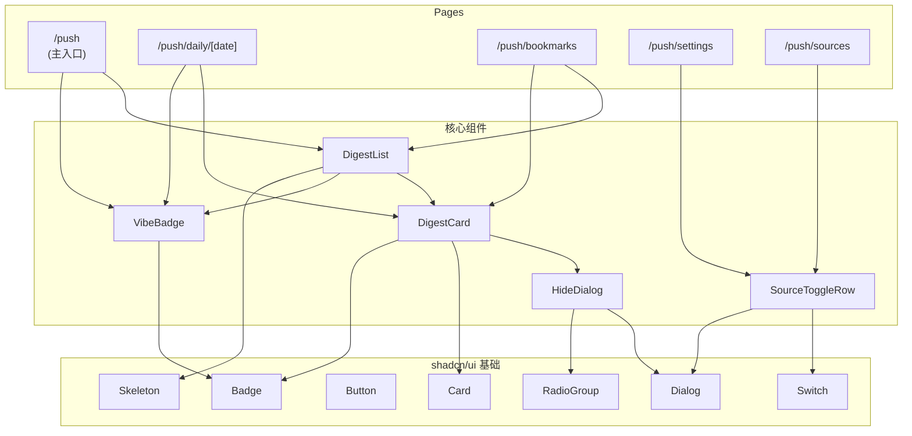

# Component Spec · AI 推送模块

> 日期：2026-07-17 · 作者：Claude · 版本：v1
> 配套：[spec.md](spec.md) · [db-design.md](db-design.md) · [api-spec.md](api-spec.md)（待出）· [product-doc.md](product-doc.md)
> 模板：[docs/templates/component-spec-template.md](../../templates/component-spec-template.md)

---

## 1. 组件清单

### 5 个页面（routes）

| 路径 | 名称 | 对应 spec | 用途 | HTML 设计 |
|---|---|---|---|---|
| `/push` | 今日 digest 主入口 | R7 In-Product Reading | 主体验 · 5 条今日 digest | [`01-today.html`](mockups/01-today.html) |
| `/push/daily/[date]` | 日报详情页 | R9 Citation + R10 Behavior | 单条详情 + 引用 + 阅读时长 | [`02-daily-detail.html`](mockups/02-daily-detail.html) |
| `/push/bookmarks` | 我的收藏 | (R10 bookmark 数据展示) | 收藏的 digest 列表 | [`03-bookmarks.html`](mockups/03-bookmarks.html) |
| `/push/settings` | 推送设置 | R5 + R6 | 信源偏好 + 推送时间 + 标签 | [`04-settings.html`](mockups/04-settings.html) |
| `/push/sources` | 信源管理 | R5 Source Customization | 系统默认 + 用户自定义 RSS CRUD | [`05-sources.html`](mockups/05-sources.html) |

> **可打开设计**：直接 `open mockups/01-today.html` 在浏览器看。每页 200-290 行 standalone HTML · 含完整 inline CSS · 真实 AI 内容 · 移动端响应式 · 含 spec 全部细节（vibe badge / 双轴标签 / hide dialog / 信源管理 modal）

### § 1.5 页面 ASCII Wireframe

#### Page 1 · `/push` 今日主入口

```
┌───────────────────────────────────────────────────────┐
│ KnockWise · AI 推送         [今日] [收藏] [设置] [信源]│
├───────────────────────────────────────────────────────┤
│ 📰 今日 5 条 · 正常推送                                 │
├───────────────────────────────────────────────────────┤
│ 2026-07-17 · 周五                                       │
│ 5 分钟读完 · AI/LLM/Agent 最新动态                       │
├───────────────────────────────────────────────────────┤
│ ┌───────────────────────────────────────────────────┐ │
│ │ [模型][国外][头条] · Anthropic News · 4h前         │ │
│ │ Claude 4.7 Sonnet 发布：1M 上下文 + Agentic...    │ │
│ │ 摘要：Anthropic 发布 Claude 4.7 Sonnet...          │ │
│ │ ⏱ 4分钟 · ⭐4.9   [🔖 已收藏] [🔇 屏蔽]            │ │
│ └───────────────────────────────────────────────────┘ │
│ ┌───────────────────────────────────────────────────┐ │
│ │ [模型][国内][头条] · DeepSeek Docs · 2h前          │ │
│ │ DeepSeek V4 Pro 永久降价至原价 1/4...             │ │
│ │ ⏱ 3分钟 · ⭐4.8   [🔖 收藏] [🔇 屏蔽]              │ │
│ └───────────────────────────────────────────────────┘ │
│ ... (3 more cards)                                      │
├───────────────────────────────────────────────────────┤
│ 2/5 已读 · 剩余 3 分钟                                  │
│ 推送时间：每天 08:00 (Asia/Shanghai)                   │
└───────────────────────────────────────────────────────┘
```

#### Page 2 · `/push/daily/[date]` 日报详情

```
┌───────────────────────────────────────────────────────┐
│ KnockWise         [今日] [收藏] [设置] [信源]            │
├───────────────────────────────────────────────────────┤
│ ← 返回今日 5 条                                          │
├───────────────────────────────────────────────────────┤
│ [模型][国外] · Anthropic News · 4h前 · ⭐4.9 · ⏱ 4min  │
│                                                        │
│ # Claude 4.7 Sonnet 发布：1M 上下文 + Agentic Coding 优化│
│                                                        │
│ Anthropic 发布 Claude 4.7 Sonnet，主打 1M token 上下文   │
│ + 工具调用稳定性提升 23%。SWE-bench Verified 得分 78.4%│
│                                                        │
│ ┌─ 📰 原文来源 ──────────────────────────────────────┐ │
│ │ Anthropic News                                       │ │
│ │ https://www.anthropic.com/news/claude-4-7-sonnet    │ │
│ │ 发布于 2026-07-17 04:30 PT · 4 小时前               │ │
│ └────────────────────────────────────────────────────┘ │
│                                                        │
│ [✓ 已收藏]  [📤 分享]  [🔇 不再推送类似]                │
│                                                        │
│ 📚 相关历史 digest                                       │
│ • 7/10 Claude 4.5 Sonnet 性能提升：SWE-bench 76.3%...  │
│ • 7/03 Anthropic 推出 Agentic Tool Use 协议 MCP v2...   │
│ • 6/25 Claude Code 0.3 发布：sub-agent 编排...         │
└───────────────────────────────────────────────────────┘

[点击 🔇 弹出 HideDialog modal：]
┌──────────────────────────────────┐
│ 不再推送类似内容？               │
│ Claude 4.7 Sonnet 发布：1M 上下文 │
│                                  │
│ ◉ 不感兴趣                        │
│ ○ 已从其他渠道看过                │
│ ○ 内容质量低                      │
│                                  │
│ 关键词（点击屏蔽）：              │
│ [Claude] [Anthropic] [Agent] ... │
│ 屏蔽后 7 天内同类内容权重 -50%   │
│                                  │
│ [取消]              [确认屏蔽]   │
└──────────────────────────────────┘
```

#### Page 3 · `/push/bookmarks` 我的收藏

```
┌───────────────────────────────────────────────────────┐
│ KnockWise         [今日] [收藏*] [设置] [信源]            │
├───────────────────────────────────────────────────────┤
│ 📥 我的收藏                                              │
│ 18 条 · 包含 5 个模型 / 7 个应用 / 6 个论文 · 跨 6 家公司 │
├───────────────────────────────────────────────────────┤
│ [全部(18)] [模型(5)] [应用(7)] [论文(6)]    排序：[▼]  │
├───────────────────────────────────────────────────────┤
│ ┌───────────────────────────────────────────────────┐ │
│ │ [模型][国外] · Anthropic News                       │ │
│ │ Claude 4.7 Sonnet 发布：1M 上下文 + Agentic...    │ │
│ │ 摘要：Anthropic 发布 Claude 4.7 Sonnet...          │ │
│ │ 收藏于 2026-07-17 12:45 · 推送自 08:00  [查看原文→]│ │
│ └───────────────────────────────────────────────────┘ │
│ ┌───────────────────────────────────────────────────┐ │
│ │ [应用][国外] · LangChain Blog                      │ │
│ │ LangChain v0.4 发布：Middleware API + ...         │ │
│ └───────────────────────────────────────────────────┘ │
│ ... (2 more)                                             │
├───────────────────────────────────────────────────────┤
│ 显示前 4 条 · 共 18 条 · 查看全部 →                      │
└───────────────────────────────────────────────────────┘
```

#### Page 4 · `/push/settings` 推送设置

```
┌───────────────────────────────────────────────────────┐
│ KnockWise         [今日] [收藏] [设置*] [信源]            │
├───────────────────────────────────────────────────────┤
│ ⚙️ 推送设置                                              │
│ 配置你的 AI 推送时间、渠道和偏好标签                       │
├───────────────────────────────────────────────────────┤
│ ⏰ 推送时间                                              │
│ ┌────────────────────────────────────────────────────┐ │
│ │ 推送时间              [08]:[00]                      │ │
│ │ 时区                  [Asia/Shanghai (UTC+8)  ▼]   │ │
│ │ 周末推送              [● 启用]                      │ │
│ └────────────────────────────────────────────────────┘ │
│                                                        │
│ 📡 推送渠道                                              │
│ ┌────────────────────────────────────────────────────┐ │
│ │ 邮件通知 (wangtianyu@163.com)     [● 启用]         │ │
│ │ 微信公众号 (未绑定 · P2 上线)      [○ 禁用]         │ │
│ │ macOS 通知                          [○ 禁用]         │ │
│ └────────────────────────────────────────────────────┘ │
│                                                        │
│ 🏷 关注标签（最多 10 个）                                  │
│ [Agent ×] [LLM ×] [RAG ×] [MoE ×] [国产模型 ×] [+ 添加]  │
│                                                        │
│ 🚫 屏蔽标签（最多 10 个）                                  │
│ [元宇宙 ×] [区块链 ×] [+ 添加]                            │
├───────────────────────────────────────────────────────┤
│ ● 有未保存的修改                            [保存设置]  │
└───────────────────────────────────────────────────────┘
```

#### Page 5 · `/push/sources` 信源管理

```
┌───────────────────────────────────────────────────────┐
│ KnockWise         [今日] [收藏] [设置] [信源*]            │
├───────────────────────────────────────────────────────┤
│ 📡 信源管理                                              │
│ 系统默认 8 源 · 自定义 4 源 · 全部启用中                  │
├───────────────────────────────────────────────────────┤
│ ┌──────────┬──────────┬──────────┬──────────┐            │
│ │  12     │   8     │   4     │  12     │           │
│ │ 信源总数│系统默认 │我的自定义│ 启用中  │           │
│ └──────────┴──────────┴──────────┴──────────┘            │
│                                                        │
│ [全部(12)] [系统(8)] [我的(4)] [模型] [应用] [+ 添加自定义源]│
├───────────────────────────────────────────────────────┤
│ 📰 Anthropic News                                       │
│ https://www.anthropic.com/news/rss.xml                  │
│ [国外][模型][系统] · 4h前 · 12条          [●][···]   │
│                                                        │
│ 🤖 DeepSeek Docs News                                   │
│ https://api-docs.deepseek.com/news/rss.xml              │
│ [国内][模型][系统] · 2h前 · 5条          [●][···]   │
│                                                        │
│ 📚 Qwen GitHub Releases                                 │
│ https://github.com/QwenLM/Qwen3/releases.atom          │
│ [国内][模型][系统] · 8h前 · 3条          [●][···]   │
│                                                        │
│ 📡 稀土掘金 AI 标签                                     │
│ https://rsshub.app/juejin/tag/AI                       │
│ [国内][应用][自定义] · 3h前 · 15条       [●][···]   │
│ ...                                                     │
├───────────────────────────────────────────────────────┤
│ 显示前 5 条 · 共 12 条 · 加载更多 →                      │
└───────────────────────────────────────────────────────┘

[点击 + 添加自定义源 弹出 modal：]
┌──────────────────────────────────────┐
│ + 添加自定义 RSS 源                  │
│ 支持任意标准 RSS / Atom feed          │
│                                      │
│ 源名称  [稀土掘金 LLM tag]            │
│ RSS URL [https://rsshub.app/juejin/tag/LLM]│
│ 分类    [模型 (model) ▼]              │
│ 地域    [国内 (domestic) ▼]            │
│                                      │
│ [取消]              [添加并启用]      │
└──────────────────────────────────────┘
```

### 5 个核心组件

| 组件名 | 类型 | 复用范围 | 依赖 |
|---|---|---|---|
| `<DigestCard>` | 展示组件（双 mode） | 全局 · /push /daily/[date] /bookmarks | shadcn/ui Card · Next.js Image |
| `<DigestList>` | 容器组件 | /push /bookmarks | DigestCard · VibeBadge · useDigest API |
| `<VibeBadge>` | 展示组件 | /push /daily/[date] /weekly（Phase 2）| shadcn/ui Badge · cn() |
| `<SourceToggleRow>` | 表单组件 | /push/settings /push/sources | shadcn/ui Switch · DropdownMenu |
| `<HideDialog>` | 通用组件 | /push /daily/[date] · 所有卡片可用 | shadcn/ui Dialog · RadioGroup |

**类型分类**：
- 展示组件（Display）：只读展示 · `DigestCard` / `VibeBadge`
- 容器组件（Container）：布局 + 数据流 · `DigestList`
- 表单组件（Form）：用户输入 · `SourceToggleRow`
- 通用组件（Common）：交互弹窗 · `HideDialog`

---

## 2. 每个组件详细定义

### 2.1 `<DigestCard>`

#### 用途
展示单条 digest 卡片。两种 mode：
- **compact**（/push 列表用）：标题 + 摘要 + 关键元信息 · 一行 height
- **expanded**（/push/daily/[date] 详情用）：完整摘要 + 引用溯源 + related items + 屏蔽/收藏按钮

#### Props

```typescript
import type { DigestItem } from '@/types/digest';

interface DigestCardProps {
  /** digest 数据（必填） */
  item: DigestItem;

  /** 显示模式 */
  mode?: 'compact' | 'expanded';  // 默认 'compact'

  /** 是否已读（用于标灰） */
  isRead?: boolean;

  /** 当前用户 ID（用于收藏/屏蔽操作） */
  userId: string;

  /** expanded 模式下是否展示 related items */
  showRelated?: boolean;

  /** expanded 模式下是否展示 source 完整溯源 */
  showSourceDetail?: boolean;

  /** 点击"详情"回调 */
  onOpenDetail?: (itemId: string) => void;

  /** 点击"屏蔽"回调（打开 HideDialog） */
  onHide?: (itemId: string, reason: HideReason) => void;

  /** 点击"收藏"回调 */
  onBookmark?: (itemId: string) => void;

  /** 点击"取消收藏"回调 */
  onUnbookmark?: (itemId: string) => void;

  /** 收藏状态（用于切换按钮显示） */
  bookmarked?: boolean;
}

type HideReason = 'not_interested' | 'low_quality' | 'already_seen';
```

#### State

```typescript
interface DigestCardState {
  isHovered: boolean;          // hover 状态（影响元信息可见性）
  isHideDialogOpen: boolean;   // HideDialog 开关状态
  isBookmarking: boolean;      // 收藏操作 loading
  isReadTracking: boolean;      // 已读上报 loading
  hideDialogReason: HideReason | null;  // 当前选择的屏蔽原因
}
```

#### Events

| 事件 | 触发时机 | 携带数据 |
|---|---|---|
| `onClickTitle` | 用户点击标题（compact）/ 整个卡片（expanded）| `{ itemId }` |
| `onHideSubmit` | HideDialog 提交 | `{ itemId, reason }` |
| `onBookmarkToggle` | 用户点击收藏图标 | `{ itemId, bookmarked }` |
| `onReadTracked` | 用户停留 ≥ 30 秒 | `{ itemId, durationSec }` |

#### 依赖

```typescript
// API
import { postDigestRead, postDigestBookmark, deleteDigestBookmark } from '@/api/digest';

// UI 库（shadcn/ui · 项目已有）
import { Card } from '@/components/ui/card';
import { Badge } from '@/components/ui/badge';
import { Button } from '@/components/ui/button';
import { Switch } from '@/components/ui/switch';

// 类型
import type { DigestItem, HideReason } from '@/types/digest';

// Icons
import { BookmarkIcon, BookmarkCheckIcon, ExternalLinkIcon, EyeOffIcon, ClockIcon } from 'lucide-react';
```

#### 视觉规格

```markdown
- 宽度: 100%（卡片宽度 = 父容器）
- 高度:
  - compact: 固定 120px
  - expanded: 自适应（120px 起 + 摘要/溯源/related）
- 主色: 
  - 未读: 浅灰底 #f9fafb + 蓝色左边框 #3b82f6 (4px)
  - 已读: 白底 + 灰左边框 #d1d5db (1px)
- 圆角: 8px
- 间距: 12px（标题到摘要）/ 8px（摘要到元信息）
- 字体:
  - 标题: 16px / 600 weight（compact）/ 20px（expanded）
  - 摘要: 14px / 400 weight / 行高 1.5
  - 元信息: 12px / 400 weight / 灰色 #6b7280
- 标签: 
  - 模型 badge: 蓝色背景 #dbeafe + 蓝字 #1e40af
  - 应用 badge: 紫色背景 #ede9fe + 紫字 #5b21b6
  - 国内 badge: 橙色背景 #fed7aa + 橙字 #9a3412
  - 国外 badge: 绿色背景 #d1fae5 + 绿字 #065f46
```

#### 交互状态

| 状态 | 视觉反馈 | 用户操作 |
|---|---|---|
| 默认未读 | 浅灰底 + 蓝色左 border | 点击标题 |
| 默认已读 | 白底 + 灰色左 border（opacity 0.7）| 点击标题 |
| Hover (compact) | 元信息显示（duration_sec 等）| hover |
| Hover (expanded) | 整个卡片微微高亮（shadow-md）| hover |
| 收藏中 | bookmark 图标 disabled | 不可点击 |
| 收藏成功 | 图标变实心 + 短暂 toast | 不可点击 |
| 屏蔽 dialog 开 | 弹窗 + 卡片背景模糊 | 选 reason 提交 |
| 屏蔽成功 | 卡片从列表移除（slide-out 动画 200ms）| 不可操作 |
| Loading (API) | 按钮 spinner · 卡片整体 click 屏蔽 | 等待 |

#### 边界 case

```markdown
- 摘要为空（spec R1 failure）: 显示 "[摘要暂缺] 查看原文 →" 替代摘要区
- source_url 为空字符串（spec R9 edge）: "原文链接" 按钮 disabled · tooltip "原始链接不可用"
- related_item_ids 为空（expanded mode）: 不渲染 related 区块
- 阅读时长 < 30 秒（不上报已读 · spec R7 已读标记）: 不触发 onReadTracked
- 卡片点击在 expanded mode: 阻止冒泡（避免误触收藏/屏蔽按钮）
- duration_sec 显示超过 24 小时: 显示为 "X 天前" 而非 "X 小时前"
```

#### 测试要点

```markdown
- [ ] compact 模式：标题 + 摘要 + 类型/地域 badge 正确渲染
- [ ] expanded 模式：完整摘要 + related items + source detail 渲染
- [ ] isRead=true 时视觉降级（灰底 + opacity）
- [ ] hover compact 时元信息可见
- [ ] 点击"屏蔽"打开 HideDialog
- [ ] 点击"收藏"触发 API + 切换图标
- [ ] 停留 ≥ 30 秒触发 onReadTracked
- [ ] 摘要为空的 fallback 显示
- [ ] source_url 为空时按钮 disabled
- [ ] 类型 badge 颜色映射正确（model=蓝 / application=紫）
- [ ] 地域 badge 颜色映射正确（domestic=橙 / overseas=绿）
- [ ] 点击卡片不触发多次 onClickTitle（防抖）
```

---

### 2.2 `<DigestList>`

#### 用途
渲染今日 5 条 digest 列表。包含顶部 VibeBadge、5 张 DigestCard（compact mode）、底部状态行。

#### Props

```typescript
interface DigestListProps {
  /** 用户 ID */
  userId: string;

  /** 数据获取模式 */
  mode: 'today' | 'history' | 'bookmarks';

  /** history 模式下指定日期 */
  date?: string;  // 'YYYY-MM-DD'

  /** 是否显示 vibe badge */
  showVibe?: boolean;  // 默认 true

  /** 是否允许 hide/bookmark 操作（read-only 模式如分享页） */
  interactive?: boolean;  // 默认 true

  /** 空状态文案 */
  emptyMessage?: string;

  /** 数据加载完成的回调 */
  onLoaded?: (items: DigestItem[], vibe: string | null) => void;
}
```

#### State

```typescript
interface DigestListState {
  items: DigestItem[];
  vibe: string | null;
  isLoading: boolean;
  error: ApiError | null;
  hiddenItemIds: Set<string>;  // 本地已屏蔽但尚未 server 确认的 id
}
```

#### Events

| 事件 | 触发时机 | 携带数据 |
|---|---|---|
| `onItemOpen` | 用户点开某条 | `{ itemId, date }` |
| `onItemHide` | 某条 hide 成功 | `{ itemId }` |
| `onItemBookmark` | 某条 bookmark 切换 | `{ itemId, bookmarked }` |

#### 依赖

```typescript
import { useDigestToday, useDigestDate, useDigestBookmarks } from '@/hooks/digest';
import { DigestCard } from './DigestCard';
import { VibeBadge } from './VibeBadge';
import { Skeleton } from '@/components/ui/skeleton';
```

#### 视觉规格

```markdown
- 宽度: max-width 768px（移动端 100%）
- 列表项间距: 12px（卡片之间）
- vibe badge 与列表间距: 16px
- 底部 status 行: "5/5 已读 · 3 分钟" · 12px 灰色
- 空状态: 居中显示 · 图标 + emptyMessage 文字
- 加载状态: 5 个 Skeleton Card（高 120px）
```

#### 交互状态

| 状态 | 视觉反馈 | 用户操作 |
|---|---|---|
| Loading | 5 个 Skeleton | 等待 |
| Empty | 空状态插画 + "今日 digest 即将生成 · 8:00 自动推送" | — |
| Error | 红色 banner + "重试" 按钮 | 点击重试 |
| Loaded | 5 张卡片 | 操作 |
| Hide 后 | 该卡片 slide-out 200ms · 自动重排 | — |
| Bookmark 后 | bookmark icon 切换 · 不可逆 | — |

#### 边界 case

```markdown
- items.length = 0: 空状态
- items.length < 5（vibe 标注）: 正常渲染 + vibe 显示
- items.length > 5（异常）: 只取前 5 · warn 日志
- API 404（今日未生成）: 显示 "今日 digest 即将生成 · 8:00 自动推送"
- API 500: 红色 banner + 重试
- history 模式 date 格式错: redirect 到 /push
- 用户未登录: redirect 到登录页（路由级守卫）
```

#### 测试要点

```markdown
- [ ] Loading 状态渲染 5 个 Skeleton
- [ ] Empty 状态显示空状态插画
- [ ] Error 状态显示 banner + 重试按钮
- [ ] 加载完成后渲染 5 张 DigestCard
- [ ] vibe 显示在顶部
- [ ] 点击卡片触发 onItemOpen · 路由到 /push/daily/[date]
- [ ] hide 后该卡片从 DOM 移除
- [ ] bookmark 后图标切换
- [ ] interactive=false 时所有 hide/bookmark 按钮 hidden
- [ ] history 模式加载对应日期数据
- [ ] bookmarks 模式只显示已收藏的
```

---

### 2.3 `<VibeBadge>`

#### 用途
顶部 vibe 标签 · 展示今日 digest 的"氛围"信息（如 "今日 3 条 · 周末偏安静"）。

#### Props

```typescript
interface VibeBadgeProps {
  /** vibe 文本 */
  text: string | null;

  /** 严重程度（决定颜色）*/
  severity?: 'info' | 'warning' | 'empty';  // 默认 'info'

  /** 是否可关闭（点 × 隐藏）*/
  dismissible?: boolean;  // 默认 false

  /** 关闭回调 */
  onDismiss?: () => void;
}
```

#### State

```typescript
interface VibeBadgeState {
  isDismissed: boolean;  // 本地关闭状态
}
```

#### Events

| 事件 | 触发时机 | 携带数据 |
|---|---|---|
| `onDismiss` | 用户点击 × 按钮 | — |

#### 依赖

```typescript
import { Badge } from '@/components/ui/badge';
import { XIcon } from 'lucide-react';
import { cn } from '@/lib/utils';
```

#### 视觉规格

```markdown
- 高度: 32px
- 圆角: 16px（pill 形）
- 字号: 13px / 500 weight
- 颜色映射:
  - info（5 条正常）: 蓝底 #dbeafe + 蓝字 #1e40af · icon: 📰
  - warning（3-4 条）: 黄底 #fef3c7 + 黄字 #92400e · icon: ⚠️
  - empty（1-2 条）: 灰底 #f3f4f6 + 灰字 #4b5563 · icon: 🌙
- × 按钮: 14px 灰色，hover 红
```

#### 交互状态

| 状态 | 视觉反馈 |
|---|---|
| 默认 | pill 标签 · icon + 文本 |
| Dismissed | 不渲染（DOM 移除） |
| text=null | 不渲染 |
| Hover × | 颜色变红 |

#### 边界 case

```markdown
- text 为 null 或空字符串: 组件返回 null（不渲染）
- text 超过 50 字符: 截断 + tooltip 完整文本
- 多次 dismiss 后: localStorage 记忆（同日不重复显示）
```

#### 测试要点

```markdown
- [ ] text=null 时不渲染
- [ ] info 严重度显示蓝色
- [ ] warning 严重度显示黄色
- [ ] empty 严重度显示灰色
- [ ] dismissible=true 时显示 × 按钮
- [ ] 点击 × 触发 onDismiss
- [ ] 截断逻辑正确（>50 字符）
- [ ] localStorage 记忆 dismiss 状态
```

---

### 2.4 `<SourceToggleRow>`

#### 用途
信源管理列表的单行 · 显示信源信息 + 启停开关 + 操作菜单（删除 / 编辑）。

#### Props

```typescript
import type { DigestSource } from '@/types/digest';

interface SourceToggleRowProps {
  /** 信源数据 */
  source: DigestSource;

  /** 是否系统默认（系统默认隐藏删除按钮） */
  isSystemDefault: boolean;

  /** 是否启用（受控） */
  enabled: boolean;

  /** 启停回调 */
  onToggle: (sourceId: string, enabled: boolean) => Promise<void>;

  /** 删除回调（仅用户自定义源） */
  onDelete?: (sourceId: string) => Promise<void>;

  /** 编辑名称回调（仅用户自定义源） */
  onRename?: (sourceId: string, newName: string) => Promise<void>;

  /** loading 状态 */
  loading?: boolean;
}
```

#### State

```typescript
interface SourceToggleRowState {
  isMenuOpen: boolean;       // 操作菜单开关
  isRenameDialogOpen: boolean;
  newNameDraft: string;       // 编辑名称草稿
}
```

#### Events

| 事件 | 触发时机 | 携带数据 |
|---|---|---|
| `onToggle` | 用户切换开关 | `{ sourceId, enabled }` |
| `onDelete` | 用户确认删除 | `{ sourceId }` |
| `onRenameSubmit` | 用户提交新名称 | `{ sourceId, newName }` |

#### 依赖

```typescript
import { Switch } from '@/components/ui/switch';
import { DropdownMenu } from '@/components/ui/dropdown-menu';
import { Button } from '@/components/ui/button';
import { MoreVertical, Trash, Edit } from 'lucide-react';
```

#### 视觉规格

```markdown
- 高度: 64px
- 布局: 横向 flex · icon / name+url / switch / menu
- 图标: 信源类型（模型=📘 / 应用=🛠）· 32px
- 名称: 14px / 600 weight · 灰色 #374151
- URL: 12px / 400 weight · 灰色 #9ca3af · truncate 单行
- 状态 badge:
  - 系统默认: 浅蓝 "系统" badge
  - 用户自定义: 浅绿 "我的" badge
- 切换开关: 48px 宽 · 关时灰色 · 开时蓝色
- 操作菜单: ··· 按钮 · hover 显示
```

#### 交互状态

| 状态 | 视觉反馈 |
|---|---|
| 默认启用 | 蓝色 Switch ON |
| 默认禁用 | 灰色 Switch OFF |
| 切换中 | Switch disabled + spinner |
| 系统默认 | 隐藏删除按钮 |
| 用户自定义 | 显示完整操作菜单 |
| Hover 行 | 整行轻微高亮（bg-gray-50）|

#### 边界 case

```markdown
- URL 超过 50 字符: truncate + tooltip
- 系统默认源禁用后: 24h 后自动重新启用（防止误操作）
- 用户删除自己的源: confirm dialog "确定删除？历史 digest 中的引用将无法跳转"
- 同时启停多次: 防抖 500ms
- API 失败: 还原原状态 + toast 错误
```

#### 测试要点

```markdown
- [ ] 默认启停状态正确显示
- [ ] 点击 Switch 触发 onToggle
- [ ] 切换中 Switch disabled
- [ ] 系统默认源不显示删除按钮
- [ ] 用户自定义源显示完整菜单
- [ ] 删除确认 dialog 弹出
- [ ] 编辑名称 dialog 弹出
- [ ] URL truncate 正确
- [ ] API 失败还原原状态
```

---

### 2.5 `<HideDialog>`

#### 用途
屏蔽原因的弹窗 · 用户点击 🔇 后弹出 · 让用户选 reason（spec R5 hide scenario）。

#### Props

```typescript
type HideReason = 'not_interested' | 'low_quality' | 'already_seen';

interface HideDialogProps {
  /** 是否打开 */
  open: boolean;

  /** 打开状态变化回调 */
  onOpenChange: (open: boolean) => void;

  /** 确认回调 */
  onConfirm: (reason: HideReason, topicKeywords: string[]) => Promise<void>;

  /** 当前 digest 的 title（用于 dialog 标题展示） */
  digestTitle?: string;

  /** LLM 预提取的关键词（用于默认 checkbox 选项） */
  suggestedTopics?: string[];

  /** loading 状态 */
  loading?: boolean;
}
```

#### State

```typescript
interface HideDialogState {
  selectedReason: HideReason | null;
  customTopics: string[];       // 用户手动添加的关键词
  useSuggested: boolean;       // 是否使用 LLM 提取的默认关键词
}
```

#### Events

| 事件 | 触发时机 | 携带数据 |
|---|---|---|
| `onConfirm` | 用户点击确认 | `{ reason, topicKeywords }` |
| `onCancel` | 用户点击取消 | — |
| `onOpenChange` | Dialog 开关状态变化 | `{ open }` |

#### 依赖

```typescript
import { Dialog, DialogContent, DialogHeader, DialogTitle, DialogFooter } from '@/components/ui/dialog';
import { RadioGroup, RadioGroupItem } from '@/components/ui/radio-group';
import { Input } from '@/components/ui/input';
import { Badge } from '@/components/ui/badge';
import { postDigestHide } from '@/api/digest';
```

#### 视觉规格

```markdown
- 宽度: 480px
- 高度: 自适应（≈ 320px）
- 圆角: 12px
- 标题: "不再推送类似内容？"
- 副标题: digestTitle（前 50 字符 · 超长 truncate）
- reason 选项: 3 个 RadioGroupItem · 竖排
  - "不感兴趣" · "内容质量低" · "已从其他渠道看过"
- 关键词选择:
  - 默认 chips（suggestedTopics · 最多 5 个）· 可点选
  - 自定义输入框 + 添加按钮
- 底部按钮: 取消（secondary） + 确认屏蔽（destructive 红色）
```

#### 交互状态

| 状态 | 视觉反馈 |
|---|---|
| 默认 | reason 未选 · 确认按钮 disabled |
| 选了 reason | 确认按钮 enabled |
| 选了 reason + 关键词 | 确认按钮高亮 |
| 提交中 | 确认按钮 spinner + 整体不可操作 |
| 提交成功 | Dialog 关闭 · 父组件更新列表 |
| 提交失败 | Dialog 内错误 banner · 按钮还原 |

#### 边界 case

```markdown
- selectedReason 为 null: 确认按钮 disabled
- suggestedTopics 为空数组: 不显示 chips · 仅显示自定义输入
- 用户输入的关键词包含 emoji / 特殊字符: 自动过滤 · 仅保留 [a-zA-Z0-9一-龥]
- 自定义关键词超 5 个: 显示提示 "最多 5 个"
- 用户关闭 dialog（点 × 或 ESC）: 不触发 onConfirm · 状态还原
- 重复点击确认: 防抖 · 仅第一次有效
```

#### 测试要点

```markdown
- [ ] 打开时显示 dialog
- [ ] 关闭时动画消失
- [ ] 未选 reason 时确认按钮 disabled
- [ ] 选 reason 后确认按钮 enabled
- [ ] suggestedTopics chips 可点击 toggle
- [ ] 自定义关键词输入框 + 添加按钮
- [ ] 关键词超 5 个提示
- [ ] 关键词包含 emoji 时过滤
- [ ] 提交时显示 loading
- [ ] 提交成功后 dialog 关闭
- [ ] 提交失败显示错误 banner
- [ ] ESC 键关闭 dialog 不触发提交
```

---

## 3. 组件复用关系



---

## 4. 组件文件结构

```
frontend/components/digest/             # 注意：用 digest/ 不用 push/（spec 命名统一）
├── DigestCard/
│   ├── index.tsx                       # 主组件（compact + expanded 内部 switch）
│   ├── DigestCard.test.tsx             # Vitest + RTL 测试
│   ├── types.ts                        # Props / State 类型
│   ├── hooks.ts                        # useReadTracker / useBookmark
│   └── styles.module.css               # CSS Modules
├── DigestList/
│   ├── index.tsx
│   ├── DigestList.test.tsx
│   └── styles.module.css
├── VibeBadge/
│   ├── index.tsx
│   └── VibeBadge.test.tsx
├── SourceToggleRow/
│   ├── index.tsx
│   └── SourceToggleRow.test.tsx
└── HideDialog/
    ├── index.tsx
    └── HideDialog.test.tsx

frontend/pages/push/                    # Next.js Pages Router
├── index.tsx                            # /push（今日）
├── daily/[date].tsx                     # /push/daily/2026-07-17
├── bookmarks.tsx                        # /push/bookmarks
├── settings.tsx                         # /push/settings
└── sources.tsx                          # /push/sources

frontend/api/digest.ts                   # API client 封装
frontend/hooks/digest.ts                 # React Query hooks
frontend/types/digest.ts                 # TypeScript 类型（与 spec § 4 schema 对应）

mockups/                                # HTML 页面 mockup（standalone · 可打开看）
├── 01-today.html                        # 今日主入口 · vibe + 5 cards
├── 02-daily-detail.html                 # 日报详情 + HideDialog modal
├── 03-bookmarks.html                    # 我的收藏 + 筛选/排序
├── 04-settings.html                     # 推送设置（时间/渠道/标签）
└── 05-sources.html                      # 信源管理 + AddSource modal
# 注：HTML mockup 实文件在 task/mockups/ · docs/designs/ai-push-v2/index.md 仅存链接索引
```

---

## 🎯 硬性 DOD 自检

- [x] 组件清单完整（5 组件 · type + 复用范围 + 依赖）
- [x] 每个组件 5 段齐全（Props / State / Events / 依赖 / 视觉）
- [x] 交互状态 ≥ 5 种（DigestCard: 默认未读/已读/hover/loading/屏蔽成功 5+ · DigestList: loading/empty/error/loaded/hidden 5+）
- [x] 边界 case 覆盖异常路径（每组件 4-6 条边界）
- [x] 测试要点明确（每组件 6-12 条 test case）

---

## 6. 技术实现（plan 阶段后回填）

### 6.1 组件库选型

```markdown
- UI 组件库: shadcn/ui（项目已有 · Copy-Paste 模式 · 完全可控）
- 图标库: lucide-react（项目已有 · tree-shake 友好）
- 主题: 默认 + 暗色模式支持（next-themes）
```

### 6.2 状态管理

```markdown
- 局部状态: React useState / useReducer
- 全局状态: Zustand（项目已有）· 用于 user profile / theme
- 服务端状态: React Query / TanStack Query（项目已有）· 用于 digest API 缓存
- 表单状态: shadcn/ui Form + react-hook-form（轻量）
```

### 6.3 样式方案

```markdown
- CSS 方案: Tailwind CSS（项目已有 · V3 降级后稳定）
- 主题切换: CSS 变量 + shadcn/ui ThemeProvider
- 响应式: Tailwind 断点 · 移动端 / 桌面端 / 平板
```

### 6.4 测试方案

```markdown
- 单元测试: Vitest（项目已有）
- 组件测试: React Testing Library + vitest-axe（无障碍）
- E2E 测试: Playwright（项目已有 · V3.8 P5）
- 覆盖率目标: 80%
```

### 6.5 构建与发布

```markdown
- 打包工具: Next.js 自带 Webpack（项目现状）
- 类型检查: TypeScript strict
- 代码规范: ESLint + Prettier（项目已有）
- CI/CD: GitHub Actions（项目已有）
```

---

## 📚 相关文档

- [spec.md](spec.md) — 上游：技术契约
- [db-design.md](db-design.md) — 配套数据库设计
- [api-spec.md](api-spec.md) — 配套 API 接口（待出）
- [plan.md](plan.md) — 下一步：技术方案对比 + 推荐
- `docs/templates/component-spec-template.md` — 模板

---

## 元信息

- **文档版本**：v1 · 2026-07-17
- **路径**：`docs/tasks/2026-07-17-new-feature-ai-push/component-spec.md`
- **下一步**：写 api-spec.md（16 个 REST endpoint · 与 db-design 表对应）
- **Phase 2 组件预留**（spec D7）：`<WatchlistStar>` / `<WeeklyDigest>` / `<ObsidianSyncButton>` / `<CompareDiff>` · 当前 MVP 不实现
