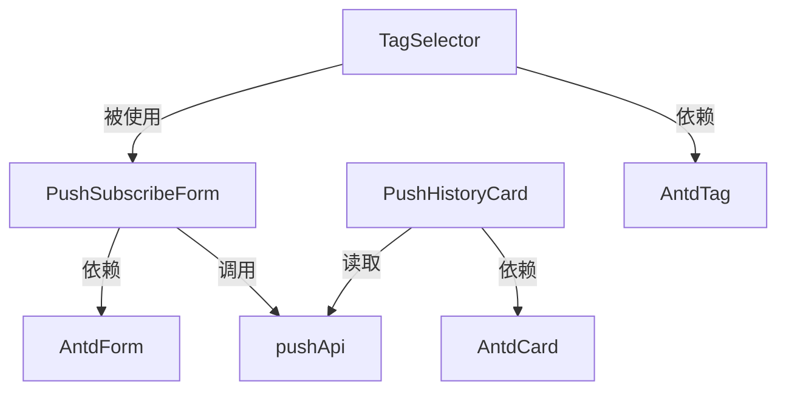

# 组件设计模板（component-spec.md）

> **一句话**：定义前端组件的 props / state / events / 依赖——**可复用的 UI 单元规格**。
>
> **产出时机**：**2 步技术详细化阶段**（**涉及新组件 / 复用组件**时必填）。从 1 步挪到 2 步，避免 1 步过早定技术细节。
>
> **作者**：**AI 主导**（前端 lead / 设计 review）。
>
> **对应 DOD**：见 `docs/DOD.md` §四.7（5 条）。

---

## 1. 组件清单（必填）

| 组件名 | 类型 | 复用范围 | 依赖 |
|---|---|---|---|
| `<PushSubscribeForm>` | 表单组件 | 全局 | Antd Form / useApi |
| `<PushHistoryCard>` | 展示组件 | 推送页 | Antd Card |
| `<TagSelector>` | 选择组件 | 订阅页 | Antd Tag |

**类型分类**：
- 表单组件（Form）：用户输入
- 展示组件（Display）：只读展示
- 容器组件（Container）：布局 + 状态管理
- 通用组件（Common）：按钮 / 标签 / 弹窗

---

## 2. 每个组件详细定义（必填）

### `<PushSubscribeForm>`

#### 用途
用户在订阅页选择标签 + 设置时间窗口，点击提交创建订阅。

#### Props（必填）

```typescript
interface PushSubscribeFormProps {
  /** 用户 ID（用于关联订阅） */
  userId: number;
  
  /** 已有订阅（编辑模式传，null = 新建） */
  initialValues?: Subscription | null;
  
  /** 提交成功回调 */
  onSuccess?: (subscription: Subscription) => void;
  
  /** 提交失败回调 */
  onError?: (error: ApiError) => void;
  
  /** 是否禁用 */
  disabled?: boolean;
}
```

#### State（必填）

```typescript
interface PushSubscribeFormState {
  selectedTags: string[];          // 已选标签
  timeWindow: TimeWindow | null;   // 时间窗口
  loading: boolean;                 // 提交中
  error: string | null;             // 错误信息
}
```

#### Events（必填）

| 事件 | 触发时机 | 携带数据 |
|---|---|---|
| `onSubmit` | 用户点击提交 | `{ tags, timeWindow }` |
| `onCancel` | 用户点击取消 | — |
| `onTagToggle` | 用户切换标签 | `{ tag, selected }` |

#### 依赖（必填）

```typescript
// API
import { useApi } from '@/hooks/useApi';
import { pushApi } from '@/api/push';

// UI 库
import { Form, Input, Button, TimePicker } from 'antd';

// 类型
import type { Subscription, TimeWindow } from '@/types/push';
```

#### 视觉规格（必填）

```markdown
- 宽度: 100%（响应式）
- 高度: 自适应内容
- 主色: #1890ff
- 圆角: 8px（按钮）/ 4px（输入框）
- 间距: 16px（标签之间）/ 24px（章节之间）
- 字体: 14px 正文 / 16px 标题
```

#### 交互状态（必填）

| 状态 | 视觉反馈 | 用户操作 |
|---|---|---|
| 默认 | 标签未选，提交按钮 disabled | 点击标签 |
| 选中 ≥ 1 | 提交按钮 enabled（蓝色） | 继续选 / 提交 |
| 选中 ≥ 4 | toast "最多 3 个" | 不增加 |
| 提交中 | loading spinner | 不可点击 |
| 成功 | toast + 跳转 | — |
| 失败 | toast "网络错误，重试" | 点击重试 |

#### 边界 case（必填）

```markdown
- 标签列表为空: 显示"暂无可选标签"
- 时间窗口格式错: 输入框红色边框 + 提示
- API 超时: 显示"加载超时，请重试"
- 重复提交: loading 期间禁用按钮
```

#### 测试要点（必填）

```markdown
- [ ] 默认状态正确
- [ ] 选中 1 个标签后提交按钮 enabled
- [ ] 选中 4 个标签提示"最多 3 个"
- [ ] 提交成功跳转到 <跳转页面>
- [ ] 提交失败显示错误
- [ ] 编辑模式正确回显已有值
- [ ] disabled 模式下不可点击
```

---

### `<PushHistoryCard>`

（同上结构：用途 / Props / State / Events / 依赖 / 视觉 / 交互 / 边界 / 测试）

---

## 3. 组件复用关系（必填）



---

## 4. 组件文件结构（必填）

```
frontend/components/push/
├── PushSubscribeForm/
│   ├── index.tsx                  # 主组件
│   ├── PushSubscribeForm.test.tsx # 测试
│   ├── types.ts                   # Props / State 类型
│   ├── hooks.ts                   # 自定义 hooks
│   └── styles.module.css          # 样式（可选）
├── PushHistoryCard/
│   └── ...
└── TagSelector/
    └── ...
```

---

## 🎯 硬性 DOD（component-spec.md 完成必须全过）

- [ ] 组件清单完整（每个组件 type + 复用范围 + 依赖）
- [ ] 每个组件 5 段齐全（Props / State / Events / 依赖 / 视觉规格）
- [ ] 交互状态 ≥ 5 种（默认 / hover / loading / success / error）
- [ ] 边界 case 覆盖异常路径
- [ ] 测试要点明确

> ⚠️ 任何 1 条未满足 → component-spec.md 不算完成
> ⚠️ TODO: 接入 `scripts/check-component-spec.py`（pre-commit hook）

---

## 🔴 触发条件

| 调研类型 | component-spec.md |
|---|---|
| new-feature + 新组件 | ✅ 必填 |
| bug + 组件问题 | ⚠️ 涉及组件时 |
| refactor + 组件重构 | ✅ 必填 |
| p0 | ❌ 不写 |

---

## 6. 技术实现（plan 阶段后填 · ⚠️ 非 1 步必填）

> **本段不在 1 步必填范围**——技术选型需要 2 步 plan 阶段确定。
>
> **填写时机**：2 步 plan.md 完成后，回填本段。
>
> §1-5 是"业务契约"（组件清单、Props、State、Events），这些 1 步定。
> §6 是"技术实现"（组件库、状态管理、样式方案），这些 plan 后定。

### 6.1 组件库选型

```markdown
- UI 组件库: <Antd / Material UI / Chakra / shadcn/ui / Element Plus>
- 图标库: <Antd Icons / Material Icons / React Icons / Lucide>
- 主题: <默认 / 自定义 / 暗色模式支持>
```

### 6.2 状态管理

```markdown
- 局部状态: <React useState / Vue ref / Svelte>
- 全局状态: <Redux / Zustand / Jotai / Pinia / Recoil>
- 服务端状态: <React Query / SWR / RTK Query>
- 表单状态: <React Hook Form / Formik / Antd Form>
```

### 6.3 样式方案

```markdown
- CSS 方案: <CSS Modules / styled-components / Tailwind CSS / Emotion / Sass>
- 主题切换: <CSS 变量 / Antd ConfigProvider / Theme UI>
- 响应式: <Media Query / Container Queries / Antd Grid>
```

### 6.4 测试方案

```markdown
- 单元测试: <Vitest / Jest / Testing Library>
- 组件测试: <React Testing Library / Vue Test Utils>
- E2E 测试: <Playwright / Cypress>
- 覆盖率目标: <80%>
```

### 6.5 构建与发布

```markdown
- 打包工具: <Vite / Webpack / Turbopack>
- 类型检查: <TypeScript strict / Flow>
- 代码规范: <ESLint + Prettier / Biome>
- CI/CD: <GitHub Actions / Vercel / 自建 Jenkins>
```

---

## 📚 相关文档

- [design-spec-template.md](design-spec-template.md) — 上游：设计脑（页面级）
- [plan-template.md](plan-template.md) — **2 步 plan 后填 §6**
- [api-spec-template.md](api-spec-template.md) — 配套 API
- `docs/DOD.md` §三.7 — component-spec.md DOD 定义
- [api-spec-template.md](api-spec-template.md) — 配套 API
- `docs/DOD.md` §三.7 — component-spec.md DOD 定义