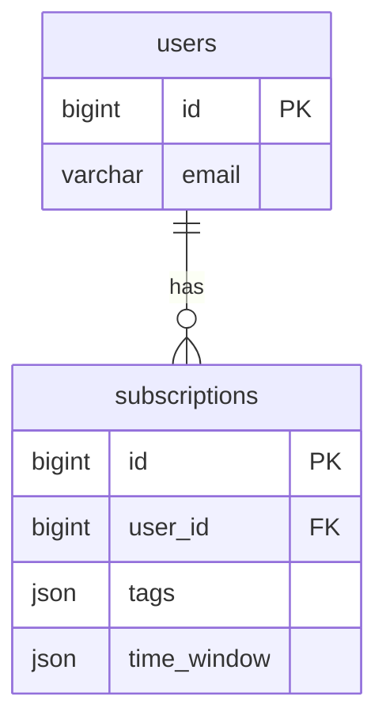

# 数据库设计模板（db-design.md）

> **一句话**：定义 schema 变更、表结构、索引、迁移 SQL——**数据库层的实现规格**。
>
> **产出时机**：**2 步技术详细化阶段**（**涉及 schema 变更时**必填）。从 1 步挪到 2 步，避免 1 步过早定技术细节。
>
> **作者**：**AI 主导**（DBA / 后端 lead review）。
>
> **对应 DOD**：见 `docs/DOD.md` §四.5（6 条）。

---

## 1. 表结构变更清单（必填）

```markdown
### 新增表
- `<table_name>` — <作用>

### 修改表
- `<table_name>` — 加 <字段> / 改 <字段类型>

### 删除表
（明确"无"也算填）
```

---

## 2. 每个表的字段定义（必填）

### `<table_name>`

| 字段 | 类型 | 约束 | 默认 | 业务不变量 |
|---|---|---|---|---|
| `id` | BIGINT | PK, AUTO_INCREMENT | — | — |
| `<field>` | VARCHAR(255) | NOT NULL, INDEX | — | 业务：<规则> |
| `<field>` | JSON | NOT NULL | NULL | 业务：<...> |
| `created_at` | DATETIME | NOT NULL, INDEX | NOW() | — |
| `updated_at` | DATETIME | NOT NULL | NOW() ON UPDATE NOW() | — |

**类型规范**：
- 字符串：VARCHAR(N) / TEXT
- 数字：INT / BIGINT / DECIMAL(M, D)
- 时间：DATETIME / TIMESTAMP
- 布尔：TINYINT(1) 或 BOOLEAN
- JSON：JSON（MySQL 5.7+）

**业务不变量**：必须是 schema 表达不了的规则（如 `age >= 0`、`state` 状态机约束）

---

## 3. 索引设计（必填）

| 表 | 索引名 | 字段 | 类型 | 用途 |
|---|---|---|---|---|
| `<table>` | `idx_<field>` | `<field>` | BTREE / UNIQUE / FULLTEXT | <查询场景> |
| `<table>` | `idx_composite` | `<field1>, <field2>` | BTREE | <组合查询> |

**索引原则**：
- 主键自动索引
- 外键必须索引
- 高频查询字段必须索引
- 不要给低基数字段单独建索引（如 boolean）

---

## 4. ER 图（必填）

用 ASCII 或 mermaid 画表关系：



**关系类型**：
- `||--||` 一对一
- `||--o{` 一对多
- `}o--o{` 多对多

---

## 5. 迁移 SQL（必填）

### Forward（升级）

```sql
-- 1. 新增表
CREATE TABLE IF NOT EXISTS users_push_subscription (
    id BIGINT NOT NULL AUTO_INCREMENT,
    user_id BIGINT NOT NULL,
    tags JSON NOT NULL,
    time_window JSON NOT NULL,
    created_at DATETIME NOT NULL DEFAULT CURRENT_TIMESTAMP,
    updated_at DATETIME NOT NULL DEFAULT CURRENT_TIMESTAMP ON UPDATE CURRENT_TIMESTAMP,
    PRIMARY KEY (id),
    UNIQUE KEY idx_user_id (user_id),
    KEY idx_created_at (created_at),
    CONSTRAINT fk_user_id FOREIGN KEY (user_id) REFERENCES users(id) ON DELETE CASCADE
) ENGINE=InnoDB DEFAULT CHARSET=utf8mb4;

-- 2. 修改表
ALTER TABLE users ADD COLUMN push_enabled BOOLEAN DEFAULT FALSE;

-- 3. 数据迁移（如需要）
INSERT INTO users_push_subscription (user_id, tags, time_window)
SELECT id, JSON_ARRAY(), JSON_OBJECT('start', '08:00', 'end', '09:00')
FROM users WHERE push_enabled = TRUE;
```

### Backward（回滚）

```sql
-- 必须可逆！否则不是合格的迁移

-- 1. 删除新表
DROP TABLE IF EXISTS users_push_subscription;

-- 2. 删除字段
ALTER TABLE users DROP COLUMN push_enabled;
```

---

## 6. 数据影响评估（必填）

```markdown
### 影响行数
- 新增表初始数据: <X 行>
- 修改表影响: <Y 行>
- 删除表: <Z 行>

### 数据迁移
- 是否需要从老表搬数据: 是 / 否
- 迁移策略: <具体方法>
- 迁移时间窗口: <估算>

### 备份策略
- 升级前必须备份: ✅ / ❌
- 备份命令: `<具体 mysqldump 命令>`
- 回滚时间窗口: <X 分钟>
```

---

## 🎯 硬性 DOD（db-design.md 完成必须全过）

- [ ] 表结构变更清单完整（新增 / 修改 / 删除）
- [ ] 每个表字段齐全（类型 + 约束 + 默认 + 业务不变量）
- [ ] 索引设计覆盖高频查询
- [ ] ER 图清晰（mermaid 或 ASCII）
- [ ] 迁移 SQL 完整（forward + backward 都可执行）
- [ ] 数据影响评估（行数 + 迁移 + 备份）

> ⚠️ 任何 1 条未满足 → db-design.md 不算完成
> ⚠️ TODO: 接入 `scripts/check-db-design.py`（pre-commit hook）

---

## 🔴 触发条件

| 调研类型 | db-design.md |
|---|---|
| new-feature + schema 变更 | ✅ 必填 |
| new-feature + 只读 schema | ⚠️ 可选 |
| bug + 数据问题 | ⚠️ 涉及 schema 时 |
| refactor + 表结构重构 | ✅ 必填 |
| p0 + 数据丢失 | ✅ 必填 |

---

## 6. 技术实现（plan 阶段后填 · ⚠️ 非 1 步必填）

> **本段不在 1 步必填范围**——技术选型需要 2 步 plan 阶段确定。
>
> **填写时机**：2 步 plan.md 完成后，回填本段。
>
> §1-5 是"业务契约"（表结构、字段、索引、ER 图），这些 1 步定。
> §6 是"技术实现"（DB 引擎、ORM、迁移工具），这些 plan 后定。

### 6.1 数据库选型

```markdown
- 数据库: <MySQL / PostgreSQL / SQLite / MongoDB>
- 引擎: <InnoDB / MyISAM / ...>
- 字符集: <utf8mb4 / utf8>
- 排序规则: <utf8mb4_unicode_ci / utf8mb4_general_ci>
- 版本: <MySQL 8.0 / PostgreSQL 15>
```

### 6.2 ORM 选型

```markdown
- ORM: <SQLAlchemy / Prisma / TypeORM / Drizzle / 原生 SQL>
- 模型定义: <Declarative / Code-First / Schema-First>
- 关系加载: <Lazy / Eager / Selectinload>
```

### 6.3 迁移工具

```markdown
- 迁移工具: <alembic / prisma migrate / flyway / liquibase>
- 迁移文件命名: <YYYY-MM-DD-name.py>
- 版本表: <alembic_version / _prisma_migrations>
```

### 6.4 数据库连接

```markdown
- 连接池大小: <5-20>
- 连接超时: <秒>
- 慢查询阈值: <毫秒>
- 备份策略: <mysqldump 每日 / 主从复制>
```

---

## 📚 相关文档

- [spec-template.md](spec-template.md) — 上游：技术规格
- [plan-template.md](plan-template.md) — **2 步 plan 后填 §6**
- [api-spec-template.md](api-spec-template.md) — 配套 API 设计
- `docs/DOD.md` §三.5 — db-design.md DOD 定义